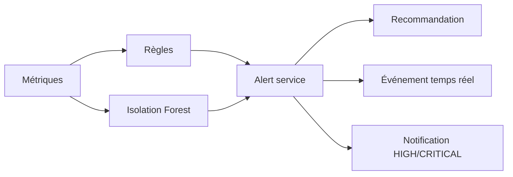

# Moteur d'alertes centralisé

## Flux réel



Il n'existe pas de table `Risk` séparée. La sévérité, le score d'anomalie, le nombre
d'occurrences et l'escalade constituent le contexte de risque utilisé par l'API et
le dashboard.

Une `Alert` contient UUID, customer, machine, timestamps, type, severity, source,
message, context JSON, anomaly score optionnel, recommendation, status, clé de
déduplication, occurrences et niveau d'escalade. Les états sont `NEW`,
`ACKNOWLEDGED`, `IN_PROGRESS` et `RESOLVED`.

## Déduplication, cooldown et corrélation

La clé SHA-256 est dérivée de machine, type et clé source (règle/dimension ou source
ML). Sous transaction, un verrou est pris sur la machine et PostgreSQL interdit deux
alertes ouvertes du même tenant et de la même clé. Pendant le cooldown, l'incident
reste durable mais toutes les occurrences ne provoquent pas une mise à jour. Hors
cooldown, `occurrences`, `last_seen_at` et le contexte sont mis à jour. Une sévérité
supérieure incrémente `escalation_level`.

La normalisation d'une règle ou le retour d'une machine résout l'alerte active. Un
nouvel incident après résolution crée une nouvelle alerte. La création et les
changements produisent un audit et `alert.created`/`alert.updated` après commit.

## API et exemple

`GET /api/alerts/` permet filtrage et pagination tenant. Les actions de cycle de vie
sont documentées dans `/api/docs/`; le backend limite les transitions selon le rôle.

```http
GET /api/alerts/?status=NEW&severity=CRITICAL
Authorization: Bearer <access-token>
```

La réponse peut inclure `structured_recommendation`; le texte court historique reste
dans `recommendation` pour compatibilité.

## Tests et diagnostic

Les tests couvrent durée, déduplication, concurrence PostgreSQL, escalade,
résolution, transitions, tenant, notifications et événements temps réel. Si des
doublons visuels apparaissent, comparer `machine`, `type`, `source_key`/dimension
et vérifier que les anciennes lignes sont réellement `RESOLVED`.
