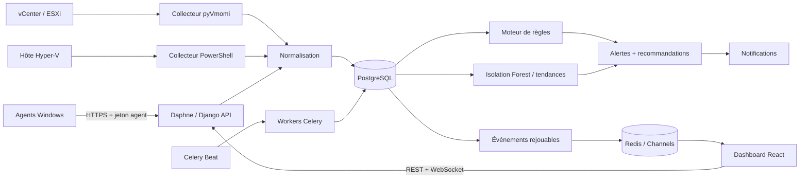
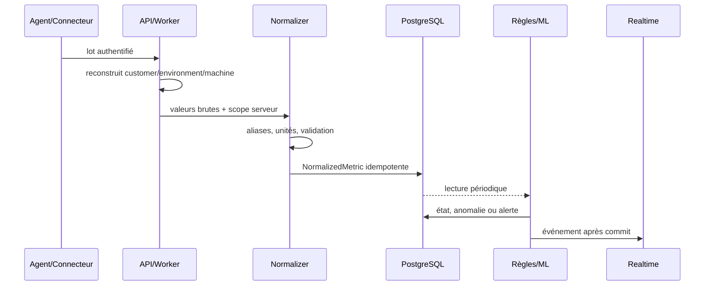

# Architecture InfraSentinel AI

## Vue d'ensemble

Il n'existe pas de modèle « Risk Engine » indépendant. Le niveau de risque visible
est dérivé des sévérités, anomalies, tendances et alertes corrélées par les services
de monitoring.

## Composants physiques

| Répertoire/application | Responsabilité réelle |
|---|---|
| `backend/accounts` | `Customer`, utilisateur, rôles ADMIN/SUPERVISOR/TECHNICIAN/CLIENT/VIEWER |
| `backend/inventory` | environnements, machines, agents, enrôlement, connecteurs et assets virtuels |
| `backend/metrics` | contrat normalisé, ingestion, historique et agrégats horaires |
| `backend/monitoring` | règles temporelles, alertes, anomalies, recommandations et audit append-only |
| `backend/ml_engine` | feature engineering, entraînement, évaluation, registry, inférence et tendances |
| `backend/integrations` | orchestration et persistance des collectes VMware/Hyper-V |
| `backend/notifications` | préférences, événements, livraisons et adaptateur Email |
| `backend/realtime` | événements durables, tickets à usage unique et consumer WebSocket |
| `backend/async_tasks` | idempotence des tâches, historique d'exécution et rapports |
| `vmware_connector` | accès pyVmomi, découverte et métriques vSphere |
| `hyperv_connector` | appel borné du script PowerShell et validation JSON |
| `agent` | collecte Windows, spool chiffré, client HTTPS et service Windows |
| `frontend` | SPA React/Vite, REST, graphiques et fallback polling |

Les domaines sont séparés par responsabilités Django plutôt que par un dossier pour
chaque nom métier. `common` assemble serializers, permissions, vues et routes; il
ne stocke pas de modèle métier.

## Flux d'une mesure

Le client n'impose jamais le tenant. Les viewsets filtrent par `customer`; les
agents utilisent le hash d'un jeton opaque lié à une machine. Les connecteurs sont
rattachés à un customer et un environnement avant leur exécution.

## Traitements synchrones et asynchrones

L'authentification, la validation, l'ingestion et les lectures courtes restent dans
le cycle HTTP. Celery exécute les collectes externes, règles planifiées, ML,
notifications, agrégats et rapports. `TaskRun` et les clés métiers rendent les
tâches critiques idempotentes. Celery Beat publie les échéances dans Redis.

## Déploiement physique

Le compose local comporte PostgreSQL 17, Redis 7.4, une étape de migration, Daphne,
un worker, Beat et Nginx. L'overlay de production ajoute Caddy pour TLS et une même
origine publique. La queue `hyperv` exige un worker Windows avec le module Hyper-V,
WinRM et les permissions adaptées; elle est volontairement absente du worker Linux.

## Limites vérifiées

- Les connexions vCenter et Hyper-V réelles ne sont pas validées dans le dépôt.
- Le dashboard n'est pas une source d'autorisation : le backend applique toujours
  RBAC et isolation objet.
- L'outbox WebSocket est durable dans PostgreSQL mais sa rétention doit être gérée
  opérationnellement; un replay est limité à 500 événements.
- Le stockage des artefacts ML est un volume partagé local, pas un object storage.

Voir aussi [Docker](DOCKER.md), [déploiement](DEPLOYMENT.md),
[sécurité](SECURITY_AUDIT.md) et [temps réel](REALTIME.md).
