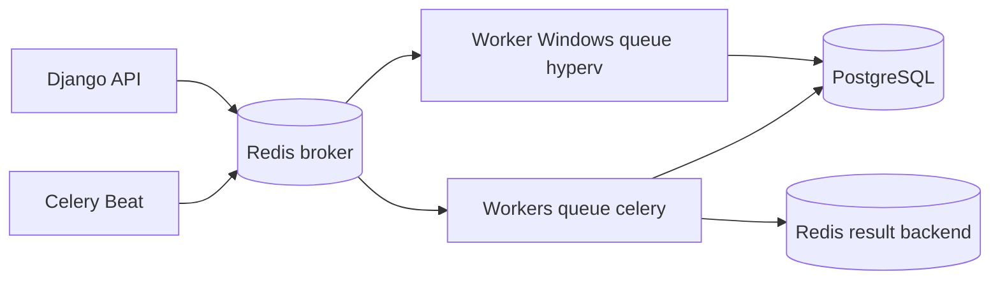

# Redis et Celery

## Périmètre

Celery traite les travaux longs, périodiques ou dépendants d'un service externe :
évaluation des règles, training/inférence/évaluation ML, notifications, collectes
VMware/Hyper-V, agrégats historiques et rapports. Authentification, validation,
ingestion et lectures courtes restent synchrones.



## Planification réelle

| Tâche | Fréquence Beat |
|---|---:|
| `monitoring.evaluate_rules` | 60 s |
| `ml.analyze_recent` | 300 s |
| `notifications.dispatch_pending` | 15 s |
| `integrations.collect_vmware` | 300 s |
| `integrations.collect_hyperv` | 300 s |
| `metrics.aggregate_history` | 3 600 s |

Celery Beat natif lit `CELERY_BEAT_SCHEDULE`; `django-celery-beat` n'est pas utilisé.

## Configuration et fiabilité

`REDIS_URL`, `CELERY_BROKER_URL` et `CELERY_RESULT_BACKEND` sont obligatoires. Les
limites par défaut sont 900 s hard/840 s soft, ACK tardif, rejet si worker perdu,
prefetch 1 et visibility timeout 3 600 s. Seuls JSON et serializers JSON sont
acceptés.

`TaskRun(customer, task_name, idempotency_key)` empêche les doublons. Un succès
retourne le résultat précédent, un `RUNNING` récent est ignoré, un `RUNNING` stale
est repris après crash et un échec peut être réessayé. Les collecteurs ajoutent des
clés idempotentes à leurs métriques. Les appels externes utilisent backoff/jitter.

## Commandes

```powershell
./.venv/Scripts/celery.exe -A config --workdir backend worker -l INFO --pool=solo -Q celery,hyperv
./.venv/Scripts/celery.exe -A config --workdir backend beat -l INFO
./.venv/Scripts/python.exe backend/manage.py shell -c "from metrics.tasks import aggregate_history; print(aggregate_history.delay().id)"
```

Sous Linux, consommer seulement `celery`; la queue `hyperv` exige un worker Windows
avec PowerShell, module Hyper-V et droits. Les tests couvrent exécution, doublon,
retry, échec, restart/stale, concurrence et isolation tenant.

## Dépannage

- tâche `PENDING` : vérifier Redis, routage/queue et worker actif;
- exécutions en double : rechercher la même idempotency key et le visibility timeout;
- tâches périodiques absentes : vérifier qu'un seul Beat tourne et son horloge;
- `hyperv` immobile : vérifier `celery inspect active_queues` sur le worker Windows;
- ne pas utiliser `CELERY_TASK_ALWAYS_EAGER=true` hors tests ciblés.
