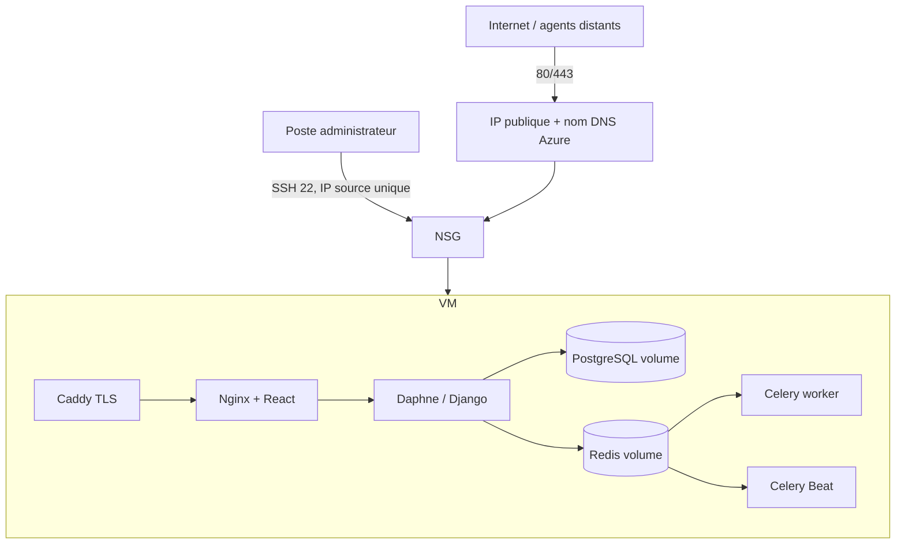

# ADR — Architecture Azure du staging InfraSentinel-AI

**Décision :** `Option A — VM Linux unique + Docker Compose`
**Statut :** accepté pour un staging temporaire ; région/SKU soumis aux quotas
**Date :** 27 août 2026

## Contexte

InfraSentinel-AI utilise Django/ASGI, React, PostgreSQL, Redis, Celery worker, Celery Beat, WebSocket, un moteur ML et des connecteurs. La pile de production existante est déjà conteneurisée et testée en composition mono-hôte. Le compte Azure for Students dispose de 100 USD, sans ressource existante.

## Options évaluées

| Critère | VM Linux + Compose | Services Azure managés/serverless |
|---|---|---|
| Parité avec le code actuel | forte | moyenne, adaptations requises |
| PostgreSQL + Redis + Celery/Beat | inclus sur l'hôte | plusieurs services payants |
| WebSocket | direct via Caddy/Daphne | possible mais architecture à adapter |
| Coût étudiant | bornable par une durée courte | addition de coûts permanents |
| Exploitation | sauvegarde et patching manuels | exploitation simplifiée |
| Haute disponibilité | non | possible mais hors budget |
| Réversibilité | suppression d'un groupe de ressources | plusieurs ressources à coordonner |

## Décision

Déployer temporairement la composition existante sur une VM Ubuntu Server 24.04 LTS x64, Trusted Launch, sans GPU. La cible minimale est 2 vCPU et 8 Gio de RAM, car PostgreSQL, Redis, deux processus Celery, Daphne, Nginx/Caddy et les traitements ML partagent l'hôte.

Le SKU candidat observé est `Standard_B2ms` (2 vCPU, 8 Gio). Le portail affichait 68,91 USD/mois en France Central mais le classait indisponible tant que `Microsoft.Compute` n'était pas enregistré. Cette valeur n'est donc pas une réservation ni une preuve de capacité. La région finale sera la première région européenne permettant réellement ce SKU ou un équivalent, après contrôle du quota et du prix.

## Architecture cible

## Nommage proposé

- groupe de ressources : `rg-infrasentinel-pfe-staging` ;
- réseau virtuel : `vnet-infrasentinel-staging` ;
- subnet : `snet-app` ;
- NSG : `nsg-infrasentinel-app` ;
- VM : `vm-infrasentinel-staging` ;
- IP : `pip-infrasentinel-staging` ;
- disque OS : nom géré par Azure, Standard SSD si compatible.

Les noms finaux peuvent recevoir un suffixe court imposé par Azure. Aucun nom ne doit contenir un email, un secret ou un identifiant d'abonnement.

## Durée et cycle de vie

1. créer le groupe de ressources et les garde-fous ;
2. créer la VM uniquement après validation du coût ;
3. déployer et exécuter les tests Azure ;
4. exporter PostgreSQL et les artefacts utiles ;
5. supprimer l'intégralité du groupe de ressources sous 72 heures ;
6. confirmer que le coût et le forecast se stabilisent.

L'arrêt de la VM n'est pas un rollback complet : le disque et l'IP peuvent continuer à coûter. La suppression du groupe de ressources est la stratégie finale.

## Conséquences et limites acceptées

- pas de haute disponibilité ;
- base et broker sur le même hôte ;
- maintenance OS et Docker à la charge du projet ;
- perte de service pendant restauration ;
- dimensionnement adapté à une démonstration PFE, pas à une production critique ;
- VMware/Hyper-V ne deviennent pas « réels » par le seul déploiement Azure : leurs environnements doivent exister séparément.

## Alternatives rejetées

- Azure Database for PostgreSQL + Azure Cache for Redis + hébergement applicatif séparé : coût et complexité incompatibles avec le crédit et la parité Compose ;
- VM gratuite minimale : mémoire insuffisante pour la pile complète et le ML ;
- Windows VM : coût/licence et surface d'administration supérieurs, sans nécessité pour le serveur central Linux ;
- Kubernetes/AKS : complexité, coût et exploitation disproportionnés pour le staging PFE.
