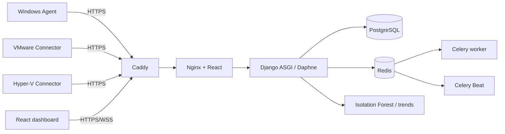

# Audit de pré-déploiement Microsoft Azure

**Projet :** InfraSentinel-AI 2.0.0
**Date :** 27 août 2026
**Portée :** dépôt local et abonnement Azure for Students, avant création de ressources
**Statut :** `LOCAL PASS — AZURE NOT PROVISIONED`

## Résumé exécutif

Le code présent dans le worktree est exécutable avec PostgreSQL et Redis locaux. La suite exhaustive relancée avant le déploiement a terminé sans échec : 186 tests backend découverts, 183 réussis et 3 ignorés car ils exigent respectivement un SMTP, un vCenter et un Hyper-V réels ; 25 tests agent et 20 tests frontend réussis. Django check, l'état des migrations, ESLint, le build Vite et `npm audit` sont également valides.

Cette validation ne transforme pas les intégrations externes non disponibles en succès. VMware réel, Hyper-V réel, SMTP externe, installation courante du service Windows et HTTPS distant restent `NOT TESTED` ou `PARTIAL` selon le rapport final existant.

L'abonnement Azure for Students est actif, sans ressource existante ni coût observé. Aucune ressource Azure n'avait été créée au moment de cet audit. Le provider `Microsoft.Compute` n'était pas enregistré et les quotas VM ne pouvaient donc pas encore être confirmés. Le provisionnement reste bloqué tant qu'une taille 2 vCPU / 8 Gio réellement disponible et son coût complet ne sont pas vérifiés dans le portail.

## 1. État du dépôt

| Contrôle | Résultat | Statut |
|---|---|---|
| Version applicative | `2.0.0` | PASS |
| Branche initiale | `main` | INFORMATION |
| Commit initial | `33c18fa` | PASS — référence identifiable |
| Worktree initial | 65 fichiers suivis modifiés et environ 60 non suivis | HIGH avant checkpoint |
| Secrets suivis | aucun secret fort détecté ; `.env` réels ignorés | PASS avec revue manuelle |
| Base de production | PostgreSQL obligatoire dans l'overlay de production | PASS |
| SQLite | option de tests/compatibilité seulement, fichier ignoré | PASS avec restriction |
| Infrastructure as Code Azure | absente | PARTIAL — déploiement portail documenté |

Le grand nombre de changements correspond aux phases de reconstruction et de validation antérieures. Ils doivent être figés sur une branche dédiée et un tag avant l'envoi vers Azure. Aucun fichier n'a été supprimé pour établir cet audit.

## 2. Architecture détectée



La composition de production contient `db`, `redis`, `migrate`, `api`, `worker`, `beat`, `frontend` et `proxy`. PostgreSQL et Redis ne publient aucun port dans l'overlay de production. Caddy termine TLS et route vers le frontend, qui achemine `/api` et `/ws` vers l'API.

## 3. Validation locale réellement exécutée

Commande exhaustive :

```powershell
.\scripts\test-all.ps1 -Database postgresql -RedisIntegration
```

Résultats du 27 août 2026 :

| Étape | Résultat observé |
|---|---|
| Django system check | 0 problème |
| Migrations | aucun changement requis |
| Backend PostgreSQL | 186 tests, 183 PASS, 3 SKIPPED, 0 FAIL |
| Couverture backend | 87 % |
| Agent Windows | 25/25 PASS |
| Frontend Vitest | 20/20 PASS |
| ESLint | PASS, aucun warning |
| Build Vite | PASS, 2 384 modules transformés |
| Audit npm | 0 vulnérabilité connue |

Une tentative SQLite n'est pas retenue comme preuve de production : une migration utilise volontairement du SQL PostgreSQL (`CREATE OR REPLACE`) et n'est pas compatible avec SQLite. La preuve de référence est PostgreSQL.

## 4. Limites et blocages avant Azure

### HIGH

- release non figée au début de l'audit ;
- disponibilité et quota Azure de la taille VM cible non confirmés ;
- domaine public final non fourni ; l'option envisagée est un nom DNS Azure associé à l'IP publique ;
- service Windows non installé dans l'état courant et installateur non signé ;
- scénario prédictif PFE courant signalé comme périmé par `FINAL_VALIDATION_REPORT.md`.

### NOT TESTED externe

- session vCenter réelle ;
- collecte Hyper-V avec permissions suffisantes ;
- SMTP réel ;
- agent Windows distant vers HTTPS Azure ;
- sauvegarde/restauration sur la VM Azure ;
- charge, reprise worker et reconnexion WebSocket sur Azure.

## 5. Critères de passage au provisionnement

1. créer une branche et un tag de checkpoint reproductibles ;
2. enregistrer les providers Azure requis sans activer de service payant ;
3. confirmer une région et une taille 2 vCPU / 8 Gio disponibles ;
4. vérifier dans le portail le coût VM, disque, IP et éventuel trafic ;
5. créer un budget/alerte avant la VM, sans modifier l'offre ni ajouter de moyen de paiement ;
6. limiter le staging à 72 heures puis supprimer le groupe de ressources ;
7. conserver au moins 20 USD de marge sur les 100 USD de crédit.

## Verdict

**LOCAL PASS — AZURE NOT PROVISIONED.** Le projet peut passer à la préparation de l'abonnement, mais aucune fonctionnalité cloud n'est déclarée opérationnelle à cette étape.
