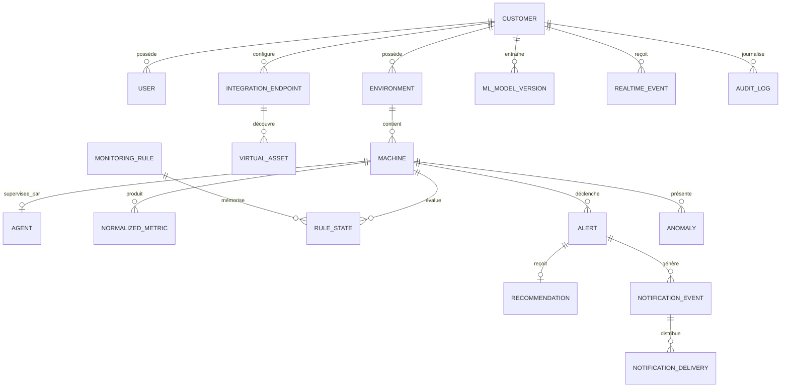

# Base de données PostgreSQL

PostgreSQL est la base principale. SQLite reste disponible uniquement avec
`DATABASE_ENGINE=sqlite` pour une importation contrôlée ou un diagnostic local; le
chemin normal, Docker et la suite de validation utilisent PostgreSQL.

## Modèle relationnel



`Customer` est la racine d'isolation. Les métriques référencent explicitement
customer, environnement et machine. `PROTECT` préserve les relations structurantes,
`CASCADE` supprime les dépendances tenant, et une anomalie peut garder sa trace
après suppression de sa métrique (`SET_NULL`).

## Contraintes et index essentiels

- UUID : tenants, inventaire, alertes, anomalies, modèles et notifications.
- `BigAutoField` : métriques Django et séquence globale des événements temps réel.
- `JSONField` : métadonnées source, contexte, explications, datasets et résultats.
- Unicité tenant/source/external_id pour les machines et connecteur/external_id
  pour les assets; hash unique pour codes d'enrôlement et jetons d'agents.
- Unicité partielle d'une alerte non résolue par tenant/clé de déduplication, d'un
  modèle ML actif par tenant et d'une métrique idempotente non nulle par tenant.
- Index machine/métrique/temps, tenant/temps, tenant/statut/sévérité et audit.
- Dates timezone-aware; Django est configuré avec `Africa/Casablanca` et `USE_TZ`.

## Configuration

```dotenv
DATABASE_ENGINE=postgresql
POSTGRES_DB=infrasentinel
POSTGRES_USER=infrasentinel
POSTGRES_PASSWORD=<secret-externe>
POSTGRES_HOST=127.0.0.1
POSTGRES_PORT=5432
POSTGRES_SSLMODE=prefer
POSTGRES_CONN_MAX_AGE=0
POSTGRES_CONN_HEALTH_CHECKS=true
POSTGRES_POOL_ENABLED=true
POSTGRES_POOL_MIN_SIZE=0
POSTGRES_POOL_MAX_SIZE=20
POSTGRES_POOL_TIMEOUT=10
POSTGRES_POOL_MAX_IDLE=60
```

Aucune valeur de connexion n'est codée dans `settings.py`. En production distante,
utiliser le mode TLS imposé par le fournisseur et vérifier ses certificats.

Le backend ASGI désactive les connexions persistantes Django avec
`POSTGRES_CONN_MAX_AGE=0` et utilise le pool fourni par
`psycopg[binary,pool]`. Le pool est paresseux (`min_size=0`) et borné à 20
connexions par processus Django. Le délai d'acquisition est de 10 secondes et une
connexion inutilisée peut être fermée après 60 secondes. Quand le pool est actif,
la configuration refuse une valeur de `POSTGRES_CONN_MAX_AGE` différente de zéro
afin de ne pas cumuler deux stratégies de persistance.

La limite de 20 est une limite **par processus**, pas une limite globale. Avant
d'ajouter des processus API, des workers Celery ou des répliques, le budget doit
inclure la somme de leurs pools, Beat, migrations, outils d'administration et une
marge réservée à PostgreSQL. Augmenter `max_connections` n'est pas le premier
correctif à appliquer.

### Validation du pool ASGI

Le rapport brut `runtime/performance/P2420260830001012.json`, exécuté avant la
correction, atteint 100 connexions PostgreSQL et 2,424 % d'erreurs HTTP au palier
de 50 agents accélérés. Après activation du pool borné, les rapports
`P2420260830104017.json` et `P2420260830104422.json` restent à 24 connexions au
maximum et à 0 % d'erreur jusqu'aux paliers accélérés de 100 et 250 agents.

Cette correction élimine l'épuisement observé des connexions, mais ne transforme
pas les paliers élevés en capacité nominale : à 250 agents, le p95 atteint
5 210,206 ms. Le plafond suivant est la concurrence et la latence applicatives.
Les détails et les limites de comparaison sont consignés dans
[PERFORMANCE.md](PERFORMANCE.md).

## Création et contrôle des migrations

```powershell
. ./scripts/common.ps1
Import-DotEnv backend/.env
./.venv/Scripts/python.exe backend/manage.py migrate
./.venv/Scripts/python.exe backend/manage.py migrate --check
./.venv/Scripts/python.exe backend/manage.py showmigrations
./.venv/Scripts/python.exe backend/manage.py makemigrations --check --dry-run
```

Le 26 août 2026, la découverte complète Django a créé une base de test PostgreSQL,
trouvé **191 tests** : **188 réussis, 3 ignorés et 0 échec**. Le
schéma OpenAPI a aussi été généré et validé. Ce résultat remplace le chiffre
historique de 48 tests, qui ne représentait qu'une étape de reconstruction.

## Migration SQLite vers PostgreSQL

1. Geler les écritures et sauvegarder les deux bases.
2. Migrer un PostgreSQL vide au même commit applicatif.
3. Exporter SQLite avec les natural keys prévues.
4. Charger les données, réinitialiser les séquences et comparer les nombres de
   lignes, FK, tenants, métriques, alertes et utilisateurs.
5. Faire une recette avant la bascule; conserver SQLite jusqu'à acceptation.

Le script `scripts/migrate-sqlite-to-postgresql.ps1` automatise les garde-fous. Ne
pas lancer `loaddata` sur une base PostgreSQL déjà alimentée.

## Sauvegarde et restauration

```powershell
pg_dump --format=custom --file=infrasentinel.dump $env:POSTGRES_DB
createdb infrasentinel_restore_test
pg_restore --dbname=infrasentinel_restore_test infrasentinel.dump
```

Tester la restauration sur une base séparée, chiffrer les dumps, stocker hors de
l'hôte principal et documenter RPO/RTO et rétention. Le volume Docker persistant ne
remplace pas une sauvegarde.

## Dépannage

- `connection refused` : vérifier service, host/port, firewall et réseau Compose.
- `password authentication failed` : vérifier le secret injecté sans l'afficher.
- tests sans droit `CREATEDB` : utiliser un compte de test dédié non production.
- migrations divergentes : comparer `showmigrations`; ne pas réécrire l'historique
  déjà appliqué.
- connexions saturées : mesurer avant d'ajuster connexion, workers ou pool; voir
  [PERFORMANCE.md](PERFORMANCE.md).
