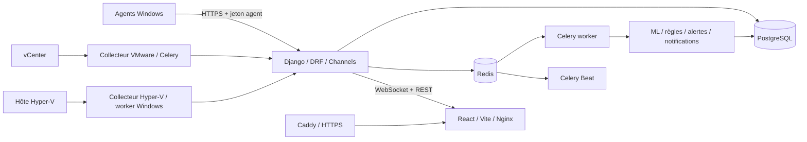

# Release finale de soutenance

## Identité de la release

| Champ | Valeur |
|---|---|
| Projet | InfraSentinel AI |
| Version applicative | `2.0.0` |
| Date de validation | 26 août 2026 |
| Base principale | PostgreSQL 17 |
| Statut | **Release candidate PFE validée localement** |
| Révision Git de départ | `33c18fa` |

Le code, les tests et la documentation sont prêts pour la soutenance. Le dépôt de
travail contient toutefois les modifications non commitées des phases 18 à 27 et
ne possède pas encore de tag `v2.0.0`. La release ne devient un artefact immuable
qu'après revue humaine du diff, commit et tag. Aucun commit ou tag n'a été créé
automatiquement afin de ne pas intégrer sans contrôle les changements déjà
présents dans le worktree.

## Fonctionnalités finales

- authentification JWT avec refresh en cookie `HttpOnly`, expiration, blacklist,
  throttling et protection CSRF des flux navigateur ;
- RBAC et isolation multi-tenant côté API, avec filtres et permissions objet ;
- agents Windows identifiés, enrollment, révocation, heartbeat, collecte,
  retry/backoff, cache local, logs rotatifs et exécution comme service ;
- inventaire centralisé des machines, environnements et assets Windows, VMware et
  Hyper-V ;
- métriques normalisées, historique, agrégats et conservation des métadonnées
  propres à chaque source ;
- connecteurs VMware et Hyper-V séparés du code métier, collectes Celery et gestion
  des erreurs ;
- règles de supervision temporelles, alertes durables dédupliquées/corrélées,
  anomalies, recommandations explicables et non destructives ;
- pipeline Isolation Forest reproductible, version des modèles, évaluation,
  inférence et analyse prédictive ;
- notifications email asynchrones avec préférences, cooldown, retry et journal des
  livraisons ;
- événements WebSocket sécurisés avec ticket court, reprise par séquence et
  fallback polling ;
- dashboard React/Vite responsive pour machines, agents, alertes, anomalies,
  VMware, Hyper-V, ML, utilisateurs, paramètres et audit ;
- AuditLog append-only, OpenAPI/Swagger privé en production, Redis, Celery worker,
  Celery Beat et rapports asynchrones ;
- images Docker reproductibles, PostgreSQL, Redis, reverse proxy Caddy HTTPS et
  procédure d'installation de l'agent Windows.

## Architecture finale



En production mono-hôte, seuls Caddy et les ports 80/443 sont exposés. Le
frontend relaie `/api/` et `/ws/` vers Django ; PostgreSQL et Redis restent sur le
réseau Docker privé. Voir [ARCHITECTURE.md](ARCHITECTURE.md) et
[DEPLOYMENT.md](DEPLOYMENT.md).

## Résultats de validation

Les contrôles suivants ont été exécutés localement sur Windows avec PostgreSQL le
26 août 2026 :

| Contrôle | Résultat |
|---|---|
| `manage.py check` | 0 problème |
| `makemigrations --check --dry-run` | aucune migration manquante |
| Suite Django/PostgreSQL/Redis | 186 découverts, **183 réussis**, 3 ignorés, 0 échec |
| Couverture backend | **87 %** lignes/branches agrégées |
| Tests agent | **25/25 réussis** |
| Tests frontend | **20/20 réussis** |
| ESLint | réussi, 0 avertissement |
| Build Vite | réussi |
| `npm audit` | 0 vulnérabilité connue |
| `pip-audit --strict` | 0 vulnérabilité connue dans `backend/requirements.txt` |
| OpenAPI strict | génération et validation réussies, 0 avertissement |
| `manage.py check --deploy` | 0 problème avec les variables de production de validation |
| Compose production | rendu `config --quiet` réussi |
| Image frontend production | build Docker réussi avec `VITE_API_URL=/api` |
| Installation Docker isolée | base/volumes neufs, migrations complètes, 6 services sains |
| Politique anonyme production | dashboard/schema/docs 401, inscription 403, agent 401 |

Les trois tests ignorés sont explicitement conditionnels : un test SMTP externe,
un test vCenter réel et un test Hyper-V réel. Ils ne sont pas présentés comme
validés. Les trois tests d'intégration Redis réel ont été exécutés avec succès.

Le dashboard a aussi été parcouru sur les onze routes principales. Aucun message
d'erreur ou avertissement console n'a été observé, et le contrôle mobile
390 × 844 n'a montré aucun débordement horizontal. Les commandes d'action sont
masquées aux rôles sans droit de gestion ; l'API reste l'autorité de sécurité.

Le 26 août, une seconde installation Compose isolée a été créée avec des volumes
vides et des ports de test. Toutes les migrations ont été appliquées depuis zéro,
PostgreSQL, Redis, API, worker, Beat et frontend sont devenus `healthy`, l'API a
renvoyé ses deux composants `ok`, le worker a répondu `pong` et le frontend HTTP
200. Les conteneurs et volumes de cette validation ont ensuite été supprimés sans
toucher aux volumes locaux, puis `scripts/start-local.ps1` a été revalidé.

## Contrôles de propreté et de sécurité

- aucun secret, fichier `.env` renseigné, journal, cache, build, base SQLite ou
  artefact temporaire n'est suivi par Git ;
- les fichiers `.env`, `backend/.env`, `frontend/.env` et
  `backend/db.sqlite3` présents localement sont ignorés ; ils ne font pas partie de
  la release ;
- PostgreSQL est imposé dans Compose et l'overlay de production ; SQLite reste
  uniquement un chemin local de compatibilité/import ;
- PostgreSQL et Redis sont publiés sur loopback uniquement en développement afin
  d'alimenter les processus locaux ; l'overlay de production retire ces deux ports ;
- aucune URL d'API ou WebSocket locale n'est embarquée dans le build de production :
  le fallback frontend est same-origin (`/api`) ;
- les occurrences loopback restantes appartiennent aux scripts/tests locaux et aux
  healthchecks internes aux conteneurs. La chaîne générique `http://localhost`
  incluse par React Router est un fallback interne de la dépendance, pas une URL de
  l'application ;
- `DJANGO_DEBUG=false`, cookies Secure, redirection HTTPS, HSTS, CORS/CSRF,
  `ALLOWED_HOSTS`, documentation privée et inscription fermée sont imposés par
  l'overlay de production ;
- l'inscription nécessite simultanément `PUBLIC_REGISTRATION_ENABLED=true` côté
  API et `VITE_PUBLIC_REGISTRATION_ENABLED=true` au build du dashboard ;
- les endpoints métier sont protégés. Les seules routes anonymes intentionnelles
  sont le healthcheck, les points d'authentification/CSRF et l'enrollment agent,
  chacun avec les validations ou throttles correspondants ;
- les secrets et tickets sont expurgés des logs ; la rotation Docker et celle de
  l'agent sont configurées ;
- les données PFE sont marquées `synthetic=true`, utilisent des domaines
  `.invalid` et ne sont jamais présentées comme des collectes VMware/Hyper-V réelles.

La recherche de secrets a couvert l'arbre courant et les deux commits de
l'historique disponible sans résultat candidat. `gitleaks` et `trufflehog`
n'étaient pas installés : un scan CI spécialisé reste recommandé avant publication
publique.

## Prérequis

### Déploiement recommandé

- VPS Linux 64 bits, Docker Engine et Docker Compose v2 ;
- domaine DNS public et ports 80/443 accessibles ;
- 4 vCPU, 8 Gio RAM et 80 Gio SSD comme point de départ PFE ;
- serveur SMTP si les emails doivent réellement quitter la plateforme ;
- stockage de sauvegarde distinct du VPS.

### Développement Windows

- Python 3.14 et environnement `.venv` ;
- Node.js 22 et npm ;
- PostgreSQL 17 et Redis 7.4 ;
- PowerShell ;
- Inno Setup uniquement pour reconstruire l'installateur agent.

Un hôte Hyper-V réel demande un worker Windows autorisé à utiliser PowerShell/WMI
et consommant la queue `hyperv`. Le worker Linux Docker ne réalise pas cette
collecte.

## Installation et lancement

### Local pour la soutenance

```powershell
Copy-Item backend/.env.example backend/.env
Copy-Item frontend/.env.example frontend/.env
# Renseigner backend/.env sans réutiliser de secret de production.
docker compose up -d db redis
./scripts/setup.ps1
./scripts/start-local.ps1
./scripts/status-local.ps1
```

Dashboard : `http://127.0.0.1:5173`. API :
`http://127.0.0.1:8000/api/health/`.

Arrêt propre :

```powershell
./scripts/stop-local.ps1
```

### Production VPS

```bash
cp .env.production.example .env.production
chmod 600 .env.production
# Générer et renseigner des secrets indépendants, le domaine et SMTP.
docker compose --env-file .env.production \
  -f docker-compose.yml -f docker-compose.prod.yml \
  -p infrasentinel config --quiet
docker compose --env-file .env.production \
  -f docker-compose.yml -f docker-compose.prod.yml \
  -p infrasentinel up -d --build --wait --wait-timeout 300
curl -fsS https://monitoring.example.com/api/health/
```

Le healthcheck attendu contient `status=ok`, `database=ok` et `redis=ok`. Aucun
déploiement distant n'a été exécuté pendant cette phase ; cette commande est la
procédure préparée, pas une preuve de mise en production.

## Comptes de démonstration non sensibles

Le dépôt ne contient aucun mot de passe de test fixe. La commande
`prepare_pfe_demo` crée, dans un tenant choisi, les comptes suivants :

- `pfe25.admin.<tenant-slug>@demo.invalid` ;
- `pfe25.supervisor.<tenant-slug>@demo.invalid` ;
- `pfe25.technician.<tenant-slug>@demo.invalid` ;
- `pfe25.client.<tenant-slug>@demo.invalid` ;
- `pfe25.viewer.<tenant-slug>@demo.invalid` ;
- `pfe25.viewer.isolated@demo.invalid` pour le tenant isolé.

Le mot de passe temporaire doit être fourni uniquement par la variable
`PFE_DEMO_PASSWORD`, faire au moins 12 caractères, puis être retiré de
l'environnement. La procédure exacte et la suppression des données sont dans
[PFE_DEMO.md](PFE_DEMO.md).

## Procédure de démonstration

1. Vérifier PostgreSQL, Redis, API, worker, Beat et dashboard avec
   `scripts/status-local.ps1`.
2. Préparer ou vérifier le jeu PFE avec `prepare_pfe_demo --verify-only`.
3. Ouvrir le dashboard global, puis une machine Windows normale.
4. Montrer CPU/RAM/disque, machine offline, règle, alerte et recommandation.
5. Montrer VMware et Hyper-V en annonçant explicitement le mode synthétique si
   aucun environnement externe n'est connecté.
6. Montrer Isolation Forest, score, version du modèle et tendance prédictive.
7. Montrer les différences admin/viewer, puis l'isolation entre tenants.
8. Montrer l'audit et la livraison email console.

Utiliser la checklist détaillée de [PFE_DEMO.md](PFE_DEMO.md) et ne jamais improviser
une connexion réelle absente.

## Limites connues

- aucune collecte n'a été validée contre un vCenter réel pendant cette release ;
- les permissions PowerShell/WMI d'un hôte Hyper-V réel et le package agent sur un
  parc Windows public n'ont pas été validés de bout en bout ;
- l'installateur Windows n'est pas signé et les upgrades interversions n'ont pas
  été validés sur une matrice de postes ;
- aucun envoi SMTP externe ni adaptateur Teams, Slack ou Telegram n'a été validé ;
  seul l'email est implémenté ;
- aucun VPS, DNS public ou certificat ACME n'a été déployé pendant la phase ;
- l'évaluation ML ne fournit pas précision/rappel sans vérité terrain labellisée ;
- les artefacts ML résident sur un volume local partagé, adapté au mono-hôte mais
  pas à une architecture haute disponibilité ;
- le test de charge court atteint le plafond de 100 connexions PostgreSQL aux
  paliers 50/100 agents. Il faut valider pooler, budget de connexions, rétention et
  soak test avant de promettre une capacité de production ;
- le throttle agent par IP peut regrouper plusieurs agents derrière le même NAT ;
- Teams, Slack et Telegram sont des points d'extension, pas des canaux livrés.

Consulter [PERFORMANCE.md](PERFORMANCE.md), [SECURITY_AUDIT.md](SECURITY_AUDIT.md)
et les limites propres à [VMWARE.md](VMWARE.md), [HYPERV.md](HYPERV.md) et
[AGENT_INSTALLATION.md](AGENT_INSTALLATION.md).

## Rollback

Avant toute mise à jour :

1. identifier et conserver le tag d'images actuellement déployé ;
2. exécuter une sauvegarde PostgreSQL avec checksum et tester sa restauration sur
   une base séparée ;
3. sauvegarder le volume `model_store` et la configuration externe des agents ;
4. conserver l'installateur agent précédent ;
5. annoncer une fenêtre où les écritures agents peuvent être suspendues.

En cas d'échec applicatif sans migration destructive : remettre
`INFRASENTINEL_IMAGE_TAG` au tag précédent puis recréer `api`, `worker`, `beat` et
`frontend`. Ne pas rétrograder automatiquement une migration dont la réversibilité
n'a pas été vérifiée.

En cas de migration incompatible : arrêter les écritures, restaurer le dump validé
dans une base séparée ou restaurer l'instance, remettre le volume ML et les images
précédentes, puis vérifier healthcheck, login, métriques et worker avant de rouvrir
les agents. Une restauration écrase des données récentes : elle nécessite une
décision d'exploitation explicite.

Pour un agent Windows : arrêter le service, désinstaller la version défaillante,
réinstaller le package précédent et réutiliser la configuration protégée seulement
si son format et son jeton restent compatibles ; sinon réenrôler l'agent.

## Commandes de contrôle avant remise au jury

```powershell
./scripts/test-all.ps1 -Database postgresql

. ./scripts/common.ps1
Import-DotEnv backend/.env
./.venv/Scripts/python.exe backend/manage.py spectacular `
  --file "$env:TEMP/infrasentinel-openapi.yaml" --validate --fail-on-warn

git diff --check
git status --short
```

Dernière étape manuelle : examiner tous les fichiers de `git status`, vérifier que
les fichiers non suivis sont intentionnels, créer un commit de release, signer ou
annoter le tag `v2.0.0`, puis publier uniquement depuis ce commit.
