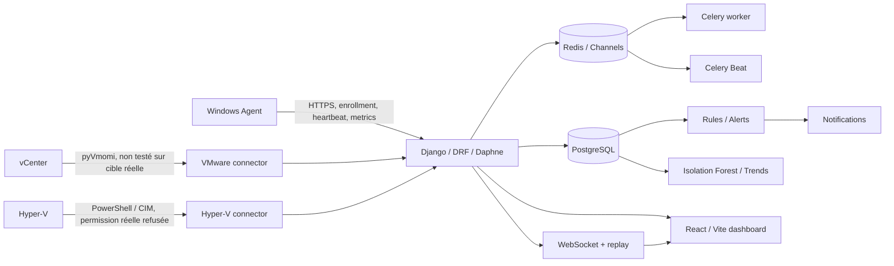

# Rapport de validation finale — InfraSentinel-AI 2.0.0

Date de validation : 26 août 2026
Environnement : Windows 11 build 26200, Python 3.14.6, Node.js 24.18.0,
Docker 29.6.2, Docker Compose 5.3.1, PostgreSQL 17.11
Portée : code présent dans le worktree local au moment de la validation.

## Executive Summary

Le cœur centralisé d'InfraSentinel-AI est opérationnel et bien testé : Django,
PostgreSQL, Redis, Celery, API, isolation multi-tenant, métriques normalisées,
règles, alertes, modèle Isolation Forest, WebSocket et frontend construisent et
passent leurs suites automatisées. Une reconstruction Docker sur volumes vierges
a également abouti avec tous les services sains.

La plateforme ne peut cependant pas être déclarée entièrement prête **dans son
état opérationnel actuel** pour la démonstration finale :

1. le scénario prédictif PFE est périmé (`predictive_trends=0`, risque maximal
   `0`, alors que la checklist exige un risque de `70`) ;
2. le service Windows Agent n'est pas installé au moment de cette validation ;
3. aucune session vCenter réelle n'est disponible et l'accès Hyper-V local est
   refusé faute de permissions ;
4. l'email réel par SMTP et le déploiement HTTPS distant n'ont pas été validés ;
5. l'installateur Windows existe et son hash est vérifié, mais il n'est pas signé ;
6. le worktree contient encore un volume important de changements non validés
   par un commit/tag de release.

Ces limites n'invalident pas les moteurs internes. Elles interdisent en revanche
de présenter VMware, Hyper-V, SMTP, déploiement distant ou l'installation agent
actuelle comme des validations réelles.

**Verdict strict : NOT READY FOR PFE DEMO.**

Une démonstration contrôlée du cœur de plateforme est possible immédiatement.
Le verdict peut devenir `READY FOR PFE DEMO` après les actions HIGH listées en fin
de rapport et un nouveau passage de la checklist.

## Architecture validée



La séparation physique détectée comprend `backend/`, `frontend/`, `agent/`,
`vmware_connector/`, `hyperv_connector/`, `scripts/`, `installer/`, `deploy/`,
`docs/` et les manifests Docker. Le backend contient 32 modèles Django. La base
active est PostgreSQL ; Redis sert le broker, le backend de résultats, le cache et
la couche Channels.

## Inventaire et état global

| Domaine | État | Preuve ou limite |
|---|---|---|
| Backend Django/DRF | PASS | checks, migrations, OpenAPI et 186 tests découverts |
| PostgreSQL | PASS | moteur Django PostgreSQL, PostgreSQL 17.11, migration vierge Docker |
| Redis/Celery/Beat | PASS | PING/PONG, worker réel, tâches réelles, Beat sain en Docker |
| Frontend React/Vite | PASS automatisé / PARTIAL visuel courant | 20 tests, lint, build, 15 routes HTTP 200 ; audit visuel intégré courant bloqué par la politique loopback du navigateur |
| Windows collector | PASS | collecte réelle locale de 17 métriques sur `LEGION` |
| Windows Service/installer courant | PARTIAL | cycle élevé documenté le 25 août, mais service absent aujourd'hui et EXE non signé |
| VMware | PARTIAL / NOT TESTED externe | vrai code pyVmomi et tests mock ; aucune session vCenter réelle |
| Hyper-V | PARTIAL / NOT TESTED externe | vrai script PowerShell/CIM ; `Get-VM` refuse les permissions sur `LEGION` |
| Normalisation | PASS | tests Windows/VMware/Hyper-V, alias, unités, métadonnées spécifiques |
| Règles/alertes | PASS | opérateurs, durée, scopes, déduplication, cooldown, escalade et cycle de vie testés |
| ML Isolation Forest | PASS technique / PARTIAL scientifique | artefact réel chargé et scoré ; dataset synthétique et absence de vérité terrain |
| Prédictions | PARTIAL | algorithmes testés, mais jeu PFE courant trop ancien : aucun risque courant |
| Recommandations | PASS | 6 recommandations courantes non destructives ; contextes VMware/Hyper-V testés |
| Temps réel | PASS | test réseau réel à deux clients, reconnexion, replay, ticket à usage unique |
| Notifications | PASS console / NOT TESTED SMTP externe | tâche Celery réelle `SENT`; test SMTP externe ignoré |
| Docker | PASS | build et démarrage complet sur volumes vierges, healthchecks verts |
| Déploiement distant | PARTIAL / NOT TESTED | configuration production cohérente ; aucun domaine/HTTPS distant testé |
| Documentation | PASS avec limites explicites | 24 documents obligatoires présents ; VMware/Hyper-V synthétiques clairement étiquetés |
| État Git de release | FAIL | nombreux fichiers modifiés/non suivis, aucun commit/tag final vérifié |

## Backend, API et sécurité applicative

### Commandes exécutées

```powershell
python backend/manage.py check
python backend/manage.py makemigrations --check --dry-run
python backend/manage.py migrate --check
python backend/manage.py spectacular --validate --fail-on-warn --file runtime/schema.yaml
python scripts/final_api_probe.py
ruff check backend agent vmware_connector hyperv_connector scripts
```

Résultats observés :

- `check` : 0 problème ;
- aucune migration manquante ;
- toutes les migrations appliquées ;
- schéma OpenAPI strict : succès sans avertissement ;
- `/api/health/`, `/api/schema/` et `/api/docs/` : HTTP 200 ;
- pagination : `count`, `next`, `previous`, `results` ;
- payload malformé : HTTP 400, sans traceback ;
- jeton JWT invalide : HTTP 401 ;
- inscription publique désactivée : HTTP 403 ;
- viewer sur `/api/users/` : HTTP 403 ;
- IDOR machine inter-tenant : HTTP 404 ;
- chaîne de recherche ressemblant à une injection : HTTP 200, aucun objet étranger
  exposé ;
- login navigateur sans cookie CSRF : HTTP 403 ;
- headers présents : CSP restrictive, `nosniff`, `DENY`, referrer `same-origin`.

Le cycle agent réel contre l'API a retourné : enrollment 201, heartbeat 200,
ingestion métrique 202, envoi inter-tenant 403 et heartbeat après révocation 401.
La suite teste aussi l'expiration JWT, le refresh, le blacklist/logout, le
throttling de connexion (429), RBAC, permissions objet, redaction des secrets,
validation des connecteurs et limites de payload.

### Corrections réalisées pendant cette validation

1. `backend/config/settings.py` : l'inscription publique n'est plus activée
   implicitement par `DEBUG`; le défaut est maintenant fermé. Les tests qui
   valident volontairement l'inscription utilisent
   `override_settings(PUBLIC_REGISTRATION_ENABLED=True)`.
2. `backend/common/testing.py` : le cache est vidé avant chaque test tenant. Cela
   supprime un échec 429 dépendant de l'ordre des classes sans modifier le
   throttling de production.
3. `docs/README.md` : le port hôte Docker du dashboard est corrigé de 8080 à 5173
   et le présent rapport est ajouté à l'index.

Après correction, le sous-ensemble auth/audit/security a réussi 27/27 et le probe
live confirme l'inscription à 403.

### Audit de secrets et dépendances

```powershell
git ls-files
git grep -Il -E '(BEGIN ... PRIVATE KEY|AKIA...|ghp_|xox...)'
pip-audit --strict -r backend/requirements.txt
npm audit --audit-level=moderate
```

Résultat : aucun `.env`, SQLite, clé privée, certificat privé, `node_modules`,
`dist`, `runtime` ou cache Python suivi par Git ; aucun secret à forte confiance ;
aucune vulnérabilité connue dans les dépendances Python verrouillées ou npm.
Ce contrôle n'est pas un secret scanner SaaS exhaustif et ne remplace pas la
rotation des secrets avant publication.

`manage.py check --deploy` sous configuration HTTPS sécurisée émet deux warnings
faibles : `SECURE_HSTS_INCLUDE_SUBDOMAINS=false` et `SECURE_HSTS_PRELOAD=false`.
Ce sont des défauts prudents tant que tous les sous-domaines ne sont pas maîtrisés.

## Base PostgreSQL

La connexion active rapporte :

- engine Django `django.db.backends.postgresql` ;
- serveur PostgreSQL 17.11 ;
- 36 tables publiques et 170 indexes ;
- 32 modèles Django ;
- données courantes après nettoyage des probes : 3 customers, 12 machines,
  1 agent, 5 assets, 250 métriques, 6 alertes, 2 anomalies et 1 modèle ML ;
- aucun connecteur réel activé.

Le test Docker vierge a appliqué depuis zéro les migrations `accounts`,
`async_tasks`, `integrations`, `inventory`, `metrics`, `ml_engine`, `monitoring`,
`notifications`, `realtime`, sessions et blacklist JWT. `migrate --check` a ensuite
retourné 0. La production force PostgreSQL ; SQLite ne subsiste que comme option
locale/de compatibilité et n'est ni incluse ni utilisée par l'overlay production.

## Frontend

```powershell
cd frontend
npm test -- --run
npm run lint
npm run build
npm audit --audit-level=moderate
```

Résultats : 20/20 tests, ESLint sans warning, 2 384 modules transformés, build
Vite réussi, aucune vulnérabilité npm connue. Les routes `/login`, `/dashboard`,
`/machines`, `/machines/:id`, `/agents`, `/alerts`, `/anomalies`, `/vmware`,
`/vmware/:id`, `/hyperv`, `/hyperv/:id`, `/ml`, `/users`, `/settings` et `/audit`
renvoient toutes HTTP 200 depuis Vite.

Les tests couvrent routage, permissions de navigation, états loading/error/empty,
URL API, temps réel et libellés synthétiques. Ils ne constituent pas une suite E2E
DOM complète. L'audit visuel précédent avait contrôlé 11 routes et un viewport
mobile 390x844 ; le navigateur intégré a refusé la reprise du tab loopback pendant
cette passe, donc aucun nouveau PASS visuel n'est revendiqué.

## Windows Agent

Une collecte réelle locale, après deux passages pour établir les débits, a produit
17 métriques : CPU, RAM, utilisation et espace disque sur trois partitions, I/O
lecture/écriture, réseau entrant/sortant, latence, uptime, nombre de processus,
GPU et état du service `EventLog`. L'identité stable contient 64 caractères, l'OS
est Windows 11 AMD64, le hostname `LEGION` et une IP est détectée.

La suite agent valide 25/25 scénarios : configuration HTTPS, credentials protégés,
redaction, enrollment, invalid token, retry/backoff, reconnexion, spool SQLite
local temporaire, replay, arrêt propre, version et installer. Aucun secret n'a été
observé dans les logs de test.

L'installateur `installer/windows/output/InfraSentinelAgent-2.0.0-setup.exe` existe
(16 198 522 octets), SHA-256
`2A023AEB3C221EFBF3A4E20709A1C05B439438342C28C8C3BBF621D112E1E0A4`, mais son
statut Authenticode est `NotSigned`. Le cycle élevé installation/upgrade/restart/
uninstall a été observé le 25 août 2026 et documenté dans
`docs/AGENT_INSTALLATION.md`. Le service est aujourd'hui absent ; ce cycle n'a donc
pas été revalidé dans l'état final courant.

## VMware et Hyper-V

### VMware

Le module utilise réellement pyVmomi (`SmartConnect`, vues `HostSystem` et
`VirtualMachine`, `PerformanceManager`). Il collecte et normalise hosts, VM,
datastores, CPU, RAM, stockage, réseau, états et relations. Les tests mock valident
orchestration, idempotence, erreurs, timeout, unités et persistance.

**NOT TESTED — REAL VMWARE ENVIRONMENT REQUIRED.** Aucune variable vCenter réelle
n'est disponible, aucun connecteur VMware réel n'est actif, et les assets PFE sont
explicitement `synthetic=true`, sur domaine `.invalid`, connecteur désactivé.

### Hyper-V

Le collecteur appelle un script PowerShell centralisé utilisant `Get-VM`,
`Get-VMHardDiskDrive`, `Get-VHD`, statistiques réseau, CIM/WMI et compteurs de
performance. Les tests mock et tâches Celery passent.

**NOT TESTED — REAL HYPER-V PERMISSIONS REQUIRED.** Le module Hyper-V et les cmdlets
sont présents sur `LEGION`, mais `Get-VM` et `Get-VMHost` retournent :
`You do not have the required permission to complete this task`. Aucun résultat
réel hôte/VM n'a été accepté comme PASS.

## Normalisation, alertes et recommandations

Un sous-ensemble de 40 tests ciblés a réussi. Il couvre :

- métriques communes Windows/VMware/Hyper-V, alias, unités et conversions de
  débits ;
- préservation des métadonnées spécifiques (datastore, VM state, service state) ;
- timestamps, idempotence, agrégats et filtres tenant ;
- opérateurs `>`, `<`, `>=`, `<=`, `==`, `!=`, durée, dimension, scope et offline ;
- 100 métriques identiques ne produisant qu'une alerte durable ;
- cooldown, escalation, réouverture et transitions NEW/ACKNOWLEDGED/IN_PROGRESS/
  RESOLVED ;
- recommandations CPU/RAM/disque, Windows, VMware et Hyper-V, explicables et non
  destructives.

Les 6 recommandations courantes inspectées sont structurées, actionnables et
marquées non destructives. Elles portent actuellement sur des données Windows de
démonstration ; les contextes VMware/Hyper-V sont prouvés par tests, pas par cible
réelle.

## Machine Learning et prédictions

Le probe `scripts/final_ml_probe.py` a réellement chargé et scoré l'artefact actif :

- algorithme : Isolation Forest ;
- version : `iforest-20260825T053548-3e711501` ;
- artefact présent, SHA-256
  `cf8b9d8f29841fa2a90744113cfdf0a9f1f2694319547ecf7508f365ebc13659` ;
- 6 features normalisées ;
- median imputer, `RobustScaler`, fenêtres 5 minutes, split chronologique 80/20 ;
- contamination 0,02, 200 estimateurs, `random_state=42`, `n_jobs=-1` ;
- 61 fenêtres courantes scorées : 59 normales et 2 anormales.

Le dataset d'entraînement est correctement déclaré synthétique (`PFE25`, 36
fenêtres, 28 train/8 validation). Aucune vérité terrain n'est disponible : précision
et rappel restent `null`. Le modèle est donc reproductible et exécutable, mais sa
performance scientifique sur données réelles étiquetées n'est pas démontrée.

Les algorithmes de tendance (plat, croissant, décroissant, bruité), croissance,
risque et estimation de franchissement sont couverts par tests. En revanche :

```text
predictive_trends   0
predictive_risk_max 0
```

sur le tenant `cgi` actuel. Les métriques PFE datent du 25 août et sortent de la
fenêtre courante ; la checklist documentaire attend au moins un risque de 70.
Le scénario prédictif de jury est donc FAIL jusqu'à régénération contrôlée.

## Temps réel

Le probe réseau `scripts/final_realtime_probe.py`, sur Daphne et Redis réels, a
observé :

```json
{
  "multiple_clients": 2,
  "broadcast_sequence_match": true,
  "replay_after_disconnect": true,
  "reused_ticket_http_status": 403
}
```

Les tests automatisés ajoutent isolation tenant, origine WebSocket, utilisateur
désactivé, événement durable en cas d'échec de diffusion et expiration. Le polling
frontend reste le fallback.

## Notifications, Celery et Redis

Le worker local répond `pong` et consomme `celery` et `hyperv`. Beat configure les
tâches règles, analyse ML, notifications, VMware, Hyper-V et historique. Une tâche
`reports.generate` réelle envoyée au broker a terminé `SUCCESS`. Une notification
email via le backend console, exécutée par le worker, a produit une livraison
`SENT`, une tentative, sans erreur. Les objets temporaires ont été supprimés.

La suite couvre politique CRITICAL/HIGH/WARNING/INFO, préférences, cooldown,
anti-doublon, retry, échec, idempotence et restart/reconnexion Redis. Les trois
tests d'intégration Redis ont été exécutés grâce à
`INFRASENTINEL_RUN_REDIS_INTEGRATION=1`.

**NOT TESTED — EXTERNAL SMTP DELIVERY.** Aucun serveur SMTP externe n'a été fourni.
Teams, Slack et Telegram sont des extensions prévues ; aucune livraison réelle sur
ces canaux n'est revendiquée.

## Docker et déploiement

Le projet Compose isolé `infrasentinel-final-validation` a été construit puis
démarré avec des ports dédiés et des volumes neufs. Après les corrections de
sécurité, l'image backend a été reconstruite et le même cycle a été rejoué sous
`infrasentinel-final-postfix` :

```powershell
docker compose build
docker compose up -d --wait --wait-timeout 300
docker compose exec -T api python manage.py migrate --check
docker compose exec -T db pg_isready -U infrasentinel -d infrasentinel
docker compose exec -T redis redis-cli ping
docker compose exec -T worker celery -A config inspect ping --timeout=10
```

Résultats : db, Redis, API, worker, Beat et frontend `healthy`; migration initiale
complète ; API santé `database=ok`, `redis=ok`; frontend HTTP 200 ; PostgreSQL
`accepting connections`; Redis `PONG`; worker `pong`; inscription publique par
défaut HTTP 403 dans l'image finale reconstruite. Les seuls ports db/Redis du
compose de développement sont liés à `127.0.0.1`. L'overlay production supprime
les publications db/Redis/API/frontend et expose uniquement Caddy 80/443.

Après vérification exacte du nom de projet, les conteneurs et volumes jetables de
ce test ont été supprimés. Le runtime local utilisateur 8000/5173 est resté actif.

Les manifests production se résolvent lorsque toutes les variables obligatoires
sont présentes et imposent `DEBUG=false`, cookies sécurisés, redirection HTTPS,
hosts/origines explicites, SMTP et secrets externes. **NOT TESTED — REMOTE HTTPS
DEPLOYMENT** : aucun DNS, certificat ACME, backup distant ou rollback distant n'a
été exécuté.

## Performance

Commande :

```powershell
scripts/run-performance-test.ps1 -Stages '1,10,25' `
  -DurationSeconds 10 -IntervalSeconds 1 `
  -HeartbeatIntervalSeconds 60 -CooldownSeconds 2 -Port 8010
```

| Agents | Requêtes | req/s | Erreurs | p95 API | CPU backend moyen |
|---:|---:|---:|---:|---:|---:|
| 1 | 11 | 1,10 | 0 % | 82,36 ms | non significatif |
| 10 | 110 | 10,94 | 0 % | 86,45 ms | 29,32 % |
| 25 | 275 | 27,49 | 0 % | 91,90 ms | 67,23 % |

À 25 agents, le p95 de traitement métrique est 68,33 ms, PostgreSQL traite environ
85,87 transactions/s avec 3 connexions actives au maximum et 99,969 % de cache
hit, Redis atteint 169 commandes/s, et les files Celery/Hyper-V restent à zéro.
Le backend atteint 99,7 % CPU en pointe : il constitue le premier risque de
capacité dans ce profil accéléré. Ce test court ne prouve pas l'endurance ni 50/100
agents. Aucun tenant P24 temporaire n'est resté en base.

Rapport brut : `runtime/performance/P2420260826092708.json`.

## Suite de tests finale

Commande exhaustive :

```powershell
scripts/test-all.ps1 -Database postgresql -RedisIntegration
```

| Suite | Découverts | Réussis | Échecs | Skipped |
|---|---:|---:|---:|---:|
| Backend PostgreSQL | 186 | 183 | 0 | 3 |
| Agent | 25 | 25 | 0 | 0 |
| Frontend | 20 | 20 | 0 | 0 |
| Total | 231 | 228 | 0 | 3 |

Couverture backend : **87 %** (3 042 statements). Les trois skips sont exactement :

1. livraison SMTP externe ;
2. collecte VMware réelle ;
3. collecte Hyper-V réelle.

Les tests Redis externes ne sont pas skipped dans ce run. Lint, build Vite et
audits npm sont intégrés à la commande et passent. Le management command
`prepare_pfe_demo.py` reste à 0 % de couverture, bien que `--verify-only` ait été
exécuté réellement.

## Qualité de code

Ruff et ESLint passent sans avertissement. Les recherches `TODO/FIXME`, debug
prints, `console.log`, secrets, localhost, fake/mock/synthetic ont été revues :

- l'unique faux positif TODO est le mot `temporary_path` dans le script backup ;
- les `print` restants sont des sorties CLI/version/diagnostic, pas des logs métier ;
- les valeurs localhost sont limitées aux exemples, mode local explicite et tests ;
- les données synthétiques PFE sont marquées et les connecteurs de démonstration
  sont désactivés ;
- aucun mock n'est utilisé comme métrique réelle de production.

La principale faiblesse de qualité de release est l'état Git très chargé : de
nombreux fichiers modifiés et non suivis doivent être relus, ajoutés puis regroupés
dans un commit final traçable. Aucun reset ou commit n'a été effectué par cette
validation afin de préserver les changements existants.

## Documentation

Les documents requis sont présents : README, architecture, database, API,
security audit, agent/installation, VMware, Hyper-V, metrics, rule/alert engines,
ML/evaluation/predictive, recommendations, notifications, async tasks, realtime,
Docker, deployment, performance, PFE demo et final release.

Les documents VMware, Hyper-V et PFE indiquent correctement que les assets du jury
sont synthétiques et ne prouvent pas une connexion externe. Swagger correspond au
code grâce au validateur strict. La présente validation complète les documents
antérieurs avec l'état courant : service agent absent, prédiction PFE périmée et
installateur non signé.

## Comparaison au cahier des charges

| Exigence | État | Justification stricte |
|---|---|---|
| Supervision Windows | PARTIAL | collecte réelle et API validées ; service non installé actuellement |
| VMware réel | NOT TESTED | code réel + mocks, aucun vCenter disponible |
| Hyper-V réel | NOT TESTED | code réel + mocks, permission locale refusée |
| Architecture centralisée multi-source | PASS | API, identities, tenants, connecteurs et multi-agent testés |
| PostgreSQL principal | PASS | moteur actif et reconstruction vierge validée |
| Historique normalisé | PASS | persistance, filtres, agrégats et trois sources testés |
| Temps réel | PASS | WebSocket réseau, deux clients, replay et sécurité validés |
| Règles configurables | PASS | opérateurs, durée, scopes, activation et API testés |
| Alertes centralisées | PASS | déduplication, cooldown, corrélation/escalade et lifecycle testés |
| Détection ML | PASS technique | artefact Isolation Forest réel chargé et inférence réalisée |
| Évaluation scientifique ML | PARTIAL | dataset synthétique, aucune vérité terrain/precision/recall |
| Analyse prédictive | PARTIAL / FAIL scénario courant | moteur testé, mais aucun risque courant dans le dataset PFE |
| Recommandations | PASS | règles structurées et non destructives inspectées/testées |
| Multi-user/RBAC | PASS | rôles et endpoints sensibles testés |
| Multi-tenant | PASS | IDOR et accès croisés utilisateur/agent refusés |
| Notifications email | PARTIAL | console/Celery validé, SMTP externe non testé |
| Redis/Celery/Beat | PASS | intégration réelle locale et Docker validée |
| API/OpenAPI | PASS | schéma strict, docs HTTP 200, contrats testés |
| Sécurité applicative | PASS avec limites | auth, RBAC, IDOR, CSRF, throttling, redaction ; transport distant non testé |
| Docker | PASS | build/up/migrate/healthchecks sur installation vierge |
| Déploiement distant | NOT TESTED | stratégie documentée, aucun environnement distant |
| Installation agent | PARTIAL | cycle antérieur documenté, état courant absent, binaire non signé |
| Performance | PARTIAL | 1/10/25 validés ; endurance et 50/100 non rejoués |
| Documentation | PASS | documents présents et limites externes explicitement signalées |

## Bugs, risques et failles

### CRITICAL

Aucun problème critique démontré par les tests exécutés.

### HIGH

1. **Scénario prédictif PFE non démontrable actuellement.** Cause : métriques
   synthétiques hors fenêtre courante. Fichiers :
   `backend/common/management/commands/prepare_pfe_demo.py`,
   `backend/ml_engine/predictive.py`, `docs/PFE_DEMO.md`. Correction : régénérer le
   tenant avec `--reset`, vérifier risque/trend, puis refaire le walkthrough.
2. **Agent final non actif.** Cause : le cycle antérieur se termine par uninstall.
   Fichiers : `installer/`, `scripts/test-windows-agent-installer.ps1`. Correction :
   installer le build final sur la machine de démonstration avec un enrollment code
   neuf et prouver service Running/Automatic, heartbeat et métriques.
3. **Installateur non signé.** Cause : absence de certificat de signature.
   Fichier : `installer/windows/output/InfraSentinelAgent-2.0.0-setup.exe`.
   Correction : signer EXE/setup, horodater, vérifier Authenticode et republier le
   checksum.
4. **Release Git non figée.** Cause : worktree comportant de nombreux fichiers
   modifiés/non suivis. Correction : revue des diffs, secret scan final, commit
   atomique, tag `v2.0.0`, puis rebuild depuis le tag.

### MEDIUM

1. VMware et Hyper-V réels restent non testés. Fournir vCenter et compte de
   service, puis droits Hyper-V/WinRM restreints et exécuter les tests externes.
2. SMTP externe non testé. Configurer un compte de test, tester succès, erreur,
   retry, cooldown et absence de secret dans les logs.
3. Déploiement HTTPS distant non testé. Valider DNS, ACME, headers, cookies,
   backup/restauration, migration et rollback sur un staging.
4. Modèle ML sans vérité terrain. Constituer un dataset réel anonymisé et étiqueté,
   recalculer précision, rappel, faux positifs et stabilité temporelle.
5. Performance courte uniquement. Rejouer 25 agents sur endurance, puis 50/100 avec
   profiling backend et pool PostgreSQL avant dimensionnement.
6. Couverture frontend limitée à un fichier de tests logique. Ajouter E2E
   authentifié, viewport mobile et tests d'erreurs réseau via Playwright/Cypress.

### LOW

1. Décider explicitement de HSTS includeSubDomains/preload après inventaire DNS.
2. Ajouter des tests au management command PFE actuellement non couvert.
3. Rejouer l'audit visuel interactif dès que l'outil navigateur autorise le tab
   loopback ou via un runner E2E local dédié.

## Corrections restantes et ordre exact

### CRITICAL

- Aucune.

### HIGH — obligatoires avant le jury

1. Saisir un mot de passe PFE temporaire non partagé, exécuter :

   ```powershell
   $env:PFE_DEMO_PASSWORD = '<secret temporaire de 12+ caractères>'
   Push-Location backend
   ..\.venv\Scripts\python.exe manage.py prepare_pfe_demo `
     --customer-slug cgi --reset
   ..\.venv\Scripts\python.exe manage.py prepare_pfe_demo `
     --customer-slug cgi --verify-only
   Pop-Location
   Remove-Item Env:PFE_DEMO_PASSWORD
   ```

   Ne continuer que si `predictive_trends > 0`, `predictive_risk_max >= 70` et les
   compteurs de `docs/PFE_DEMO.md` sont présents.
2. Installer le service Windows final avec un enrollment code jetable ; vérifier
   Running/Automatic, heartbeat ONLINE, métriques et restart, sans secret dans le
   log.
3. Signer l'installateur ou, si impossible pour le jury, documenter explicitement
   le binaire non signé et vérifier son hash devant le jury.
4. Revoir le worktree, lancer à nouveau tous les contrôles, créer le commit/tag de
   release et reconstruire les artefacts depuis ce tag.

### MEDIUM — requises pour une revendication production/réelle

- exécuter VMware réel avec `INFRASENTINEL_RUN_REAL_VMWARE=1` ;
- exécuter Hyper-V réel avec `INFRASENTINEL_RUN_REAL_HYPERV=1` sur un compte autorisé ;
- exécuter SMTP réel avec `INFRASENTINEL_RUN_EXTERNAL_SMTP=1` ;
- déployer un staging HTTPS et tester backup/restore/rollback ;
- effectuer endurance et paliers 50/100 agents ;
- évaluer le modèle sur données réelles étiquetées.

### LOW

- décision HSTS domaine complet ;
- tests du générateur PFE ;
- suite E2E frontend visuelle et responsive automatisée.

## Commandes de reproduction finales

```powershell
# Runtime local
scripts/stop-local.ps1
scripts/start-local.ps1

# Checks et suite exhaustive
scripts/test-all.ps1 -Database postgresql -RedisIntegration
ruff check backend agent vmware_connector hyperv_connector scripts
pip-audit --strict -r backend/requirements.txt

# Probes live (charger les variables de backend/.env sans les afficher)
. scripts/common.ps1
Import-DotEnv backend/.env
$env:DATABASE_ENGINE = 'postgresql'
python scripts/final_api_probe.py
python scripts/final_ml_probe.py
python -m pip install 'websockets>=15,<17'
python scripts/final_realtime_probe.py

# API et build
python backend/manage.py check
python backend/manage.py makemigrations --check --dry-run
python backend/manage.py migrate --check
cd frontend
npm test -- --run
npm run lint
npm run build
npm audit --audit-level=moderate
```

## Verdict final

**NOT READY FOR PFE DEMO** au 26 août 2026, non pas à cause d'un échec du cœur
logiciel, mais parce que le scénario prédictif obligatoire est actuellement vide,
le service agent final n'est pas installé et la release n'est pas figée. VMware,
Hyper-V, SMTP et déploiement distant doivent rester présentés comme `NOT TESTED`
tant que les infrastructures correspondantes ne sont pas réellement utilisées.
