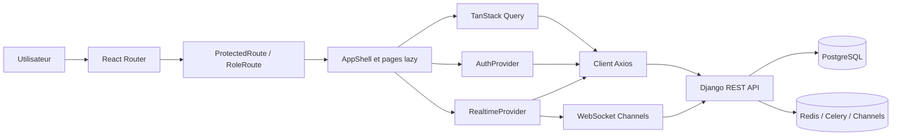
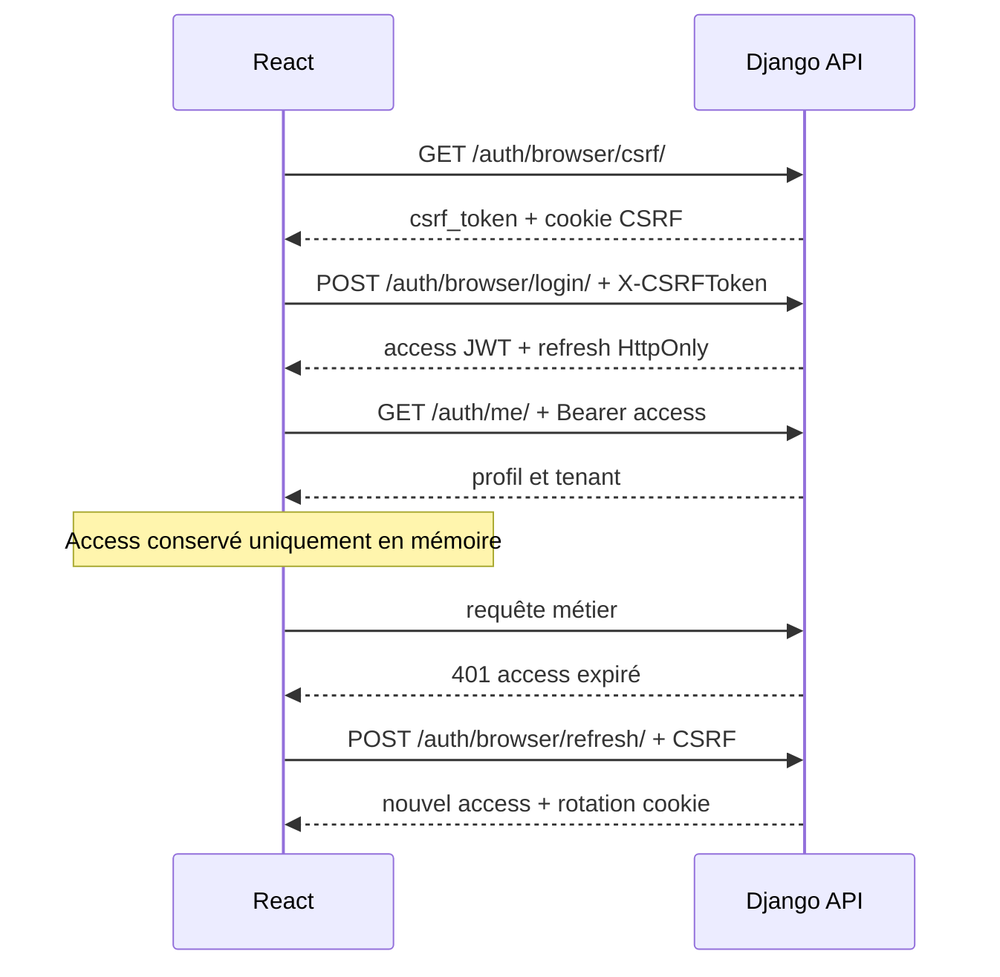

# Architecture frontend finale

## 1. Portée et principes

Le frontend InfraSentinel AI est une SPA React/TypeScript orientée exploitation NOC. Il rassemble les vues Windows, VMware, Hyper-V, règles, alertes, ML, rapports et administration sans dupliquer le métier Django.

Principes observables dans le code :

- l'API reste l'autorité pour l'authentification, le tenant, les permissions et les validations ;
- toutes les données métier affichées viennent d'appels HTTP ou WebSocket réels ;
- l'access JWT reste en mémoire et le refresh est délégué au cookie HttpOnly ;
- le cache serveur est centralisé par TanStack Query ;
- les domaines sont séparés en pages chargées à la demande ;
- un design system interne unifie les états, tableaux, overlays, formulaires et feedbacks ;
- le WebSocket accélère l'invalidation du cache, avec replay et polling de secours ;
- les limites de l'API sont indiquées dans l'interface au lieu d'être masquées.

## 2. Vue logique

## 3. Composition d'exécution

`src/main.tsx` monte, dans cet ordre :

1. `StrictMode` ;
2. `ErrorBoundary` global ;
3. `QueryClientProvider` ;
4. `BrowserRouter` ;
5. `AuthProvider` ;
6. `ToastProvider` ;
7. `App`.

Les routes privées partagent `SecuredShell`, qui compose `ProtectedRoute`, `RealtimeProvider` puis `AppShell`. Les modules sont importés via `React.lazy` et affichent un état de chargement commun pendant le téléchargement du chunk.

## 4. Couches et responsabilités

| Couche | Répertoire/fichier | Responsabilité |
|---|---|---|
| Composition | `src/app` | Routes, cache Query, frontière d'erreur. |
| Transport | `src/api` | URL de base, timeouts, JWT, CSRF, refresh sérialisé, erreurs et enveloppes paginées. |
| Identité | `src/auth` | Bootstrap de session, login/logout/register, gardes et capacités. |
| Temps réel | `src/realtime` | Ticket à usage unique, replay, déduplication, backoff, fallback. |
| Contrats | `src/types/api.ts` | Types des ressources effectivement consommées. |
| Présentation | `src/components/common` | Primitives visuelles accessibles et réutilisables. |
| Visualisation | `src/components/charts` | Séries Recharts groupées par dimension/unité. |
| Navigation | `src/components/layout` | Sidebar, topbar, recherche de pages, centre d'événements, profil. |
| Métier UI | `src/pages` | Orchestration par domaine, sans logique backend reconstituée. |
| Normalisation UI | `src/utils` | Formats français, grandes unités, dimensions métriques et groupes de graphiques. |
| Styles | `src/styles` | Tokens, base, composants, pages et breakpoints. |

La configuration sépare `SettingsPage`, responsable des requêtes et mutations, de `SettingsEditor`, responsable des formulaires et de la construction des payloads. Les éditions omettent les objets opaques `metadata`/`config` et un `secret_ref` vide afin de ne pas écraser des valeurs backend que l'interface ne modifie pas.

## 5. Modules et routes

| Domaine | Routes | Capacités principales |
|---|---|---|
| Authentification | `/login`, `/register` | Login CSRF/cookie, inscription conditionnelle. |
| Supervision globale | `/dashboard` | KPIs backend, incidents, télémétrie, risques partiels. |
| Machines | `/machines`, `/machines/:id` | Inventaire, création manager, dossier, métriques, historique, alertes, anomalies, prédictions. |
| Agents | `/agents` | Parc Windows, heartbeat, activation/révocation, code d'enrôlement temporaire. |
| Alertes | `/alerts`, `/alerts/:id` | Filtres, cycle de vie, contexte, recommandations non destructives. |
| Anomalies | `/anomalies` | Registre ML, score/seuil, explication, acquittement. |
| Prédictions | `/predictions` | Tendances par machine et fenêtres 6/24/72/168/720 h, par lots de 20. |
| ML | `/ml` | Modèles versionnés, paramètres, dataset, évaluation, anomalies et tâches. |
| Virtualisation | `/vmware`, `/vmware/:id`, `/hyperv`, `/hyperv/:id` | Connecteurs, assets, collectes et vues détaillées. |
| Rapports | `/reports` | Historique tenant et génération asynchrone de synthèses réelles. |
| Administration | `/users`, `/audit`, `/settings` | Comptes, audit, règles, notifications, environnements, connecteurs. |

La route `:id` des vues VMware/Hyper-V adresse un `VirtualAsset` présent dans l'overview. Une machine liée peut ensuite être ouverte dans le dossier machine commun.

## 6. État serveur et invalidation

TanStack Query utilise par défaut :

- données fraîches pendant 15 secondes ;
- conservation en mémoire pendant 5 minutes ;
- jusqu'à deux retries pour les erreurs transitoires ;
- aucun retry sur `401`, `403` ou `404` ;
- revalidation au retour de focus ;
- mutations sans retry automatique.

Les clés de cache sont regroupées dans `src/app/queryClient.ts` pour dashboard, machines, métriques, prédictions, agents, alertes, anomalies, modèles, intégrations, utilisateurs, audit, rapports et configuration. Les mutations invalident uniquement les racines concernées. Le logout vide tout le cache afin d'éviter qu'un utilisateur suivant voie des données privées précédemment chargées.

## 7. Authentification et autorisation

### Cycle navigateur

Le refresh est sérialisé par une promesse partagée : plusieurs `401` concurrents ne lancent pas plusieurs rotations. Un second échec déclenche l'expiration locale et la purge des données privées.

### Capacités frontend

| Rôle | Lecture infrastructure | Opérations | Utilisateurs | Audit | Tâches |
|---|---:|---:|---:|---:|---:|
| `ADMIN` | Oui | Oui | Oui | Oui | Oui |
| `SUPERVISOR` | Oui | Oui | Non | Oui | Non |
| `TECHNICIAN` | Oui | Non | Non | Non | Non |
| `CLIENT` | Oui | Non | Non | Non | Non |
| `VIEWER` | Oui | Non | Non | Non | Non |
| Superutilisateur | Toutes | Toutes | Toutes | Toutes | Toutes |

`RoleRoute` protège les pages d'administration et `canManage` masque les mutations. Ce contrôle améliore l'UX ; les permissions serveur restent la protection obligatoire contre IDOR et franchissement de tenant.

## 8. Temps réel et résilience

Le `RealtimeProvider` maintient une connexion par shell authentifié :

1. recharge les événements manqués depuis la dernière séquence ;
2. demande un ticket WebSocket à usage unique ;
3. ouvre `/ws/events/?ticket=…&since=…` ;
4. ignore les frames invalides et les séquences déjà consommées ;
5. conserve les 50 derniers événements de la session ;
6. invalide les caches associés à l'événement ;
7. se reconnecte avec un backoff exponentiel plafonné à 30 secondes et jitter ;
8. repasse au replay et au polling si le socket est absent.

| Événement | Queries invalidées |
|---|---|
| `machine.online` | dashboard, machines, agents |
| `machine.offline` | dashboard, machines, alertes |
| `metric.update` | dashboard, métriques, prédictions |
| `alert.created`, `alert.updated` | dashboard, alertes |
| `anomaly.detected` | dashboard, anomalies, alertes, modèles ML |

Le mode « polling » est un état dégradé explicite, pas une preuve de panne du backend. Hors réseau, les dernières données du cache restent visibles lorsque le composant les possède.

## 9. Métriques et visualisation

Les métriques restent normalisées selon le contrat commun (`metric_name`, `metric_value`, `unit`, `metadata`, `timestamp`). Le frontend :

- distingue les dimensions par disque, interface, service, GPU, datastore ou asset ;
- choisit la dernière valeur par métrique et dimension ;
- harmonise les unités sans fusionner des dimensions incompatibles ;
- utilise au plus une décimale ;
- convertit octets, débits, durées, fréquences, pourcentages et latences en grandes unités ;
- groupe les séries par nature d'unité ;
- limite chaque groupe graphique aux 100 points réellement chargés.

Les états de service et de VM restent textuels. Les metadata spécifiques ne sont pas supprimées et demeurent accessibles dans les vues techniques.

## 10. Design system, accessibilité et responsive

Le design system comprend boutons, icônes, badges, cartes, champs, tableaux triables, pagination, onglets, modales, drawers, confirmations, toasts, tooltips et états de données.

Mesures présentes :

- lien d'évitement vers le contenu principal ;
- navigation et fils d'Ariane nommés ;
- libellés explicites pour les contrôles iconiques ;
- `role=alert` pour les erreurs bloquantes ;
- dialogues nommés par `aria-labelledby` et fermables par `Escape` ;
- focus capturé dans les modales, drawers et navigation mobile, puis restitué au déclencheur ;
- activation des lignes cliquables par `Entrée` ou `Espace` ;
- onglets parcourables avec les flèches, `Début` et `Fin` ;
- captions invisibles pour les tableaux lorsque fournies ;
- transformation des tables en fiches sur mobile ;
- sidebar en drawer sous 1 100 px ;
- grilles mono-colonne sous 760 px.

## 11. Déploiement

Le build produit des assets statiques dans `dist`. L'image finale Nginx :

- s'exécute avec l'utilisateur non privilégié `101` ;
- sert la SPA avec fallback `index.html` ;
- relaie HTTP et WebSocket ;
- limite le corps HTTP à 3 Mo ;
- n'enregistre pas les query strings ;
- ajoute une CSP `connect-src 'self'`, `nosniff`, anti-frame, referrer et permissions policy.

Les URLs relatives `/api` et `/ws` sont préférées en production. Elles évitent d'intégrer une URL `localhost` ou une adresse d'infrastructure dans le bundle et restent compatibles avec la CSP même origine. Les valeurs `VITE_API_BASE_URL`, `VITE_WS_URL`, `VITE_POLL_INTERVAL_MS` et `VITE_AGENT_INSTALLER_URL` sont injectables comme arguments de build Docker ; une origine WebSocket externe exige d'adapter explicitement la CSP.

## 12. Limites assumées

- Le backend ne propose pas encore de recherche serveur pour la majorité des listes ; les filtres locaux ne portent que sur la page affichée.
- Les historiques ne disposent ni de fenêtre temporelle ni de downsampling configurable.
- Le dashboard ne charge qu'une page et limite les appels prédictifs à huit machines.
- La page prédictive mappe chaque lot UI de 20 machines sur les pages DRF fixes de 100 ; elle reste une stratégie de fan-out contrôlé, pas un agrégat serveur global.
- Le replay WebSocket est borné côté serveur ; le frontend boucle au plus cinq lots.
- Le suivi direct d'un job par l'identifiant Celery retourné n'existe pas dans l'API.
- La page Rapports borne son polling à deux minutes et ne prétend pas relier un rapport à un `task_id` en l'absence de contrat serveur correspondant.
- Aucune UI OTP/MFA/reset de mot de passe n'est présente, car ces fonctions n'existent pas côté backend.
- VMware et Hyper-V utilisent les overviews réels ; leur fonctionnement sur infrastructure externe ne peut être affirmé sans environnement correspondant.
- L'adaptateur Email existe, mais une livraison SMTP externe n'a pas été prouvée par les tests frontend.

Le terme « réel » dans ce document signifie « reçu d'un endpoint backend ou d'un événement WebSocket, sans fixture frontend ». Il ne certifie pas à lui seul la provenance physique de la télémétrie en amont ; cette preuve dépend de l'agent ou du connecteur et de son environnement.
