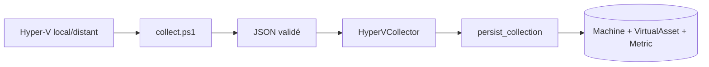

# Intégration Hyper-V

## Outils réellement utilisés

- PowerShell non interactif.
- Module Hyper-V : `Get-VM`, `Get-VMHardDiskDrive`, `Get-VHD`,
  `Get-VMNetworkAdapterStatistics`.
- CIM/WMI : `Win32_OperatingSystem`, `Win32_LogicalDisk`.
- Performance Counters : Processor et Network Interface.
- PowerShell Remoting/WinRM pour un host distant.

Toutes les commandes se trouvent uniquement dans
`hyperv_connector/scripts/collect.ps1`; le code métier Python ne contient aucune
commande PowerShell dispersée. Le secret distant est injecté temporairement dans
l'environnement du processus et n'apparaît pas dans la ligne de commande.

Hôte : CPU, RAM, disque, réseau, uptime, VM count et disponibilité. VM : état,
CPU, RAM, disque VHD, réseau, uptime et host. Les résultats JSON sont normalisés,
historisés et transmis aux règles/ML. Timeout, retour non nul, JSON invalide et
permissions insuffisantes déclenchent un état d'échec et retry Celery.

Le poste de revue dispose de PowerShell, du module Hyper-V et du service VMMS. Une
collecte réelle a été tentée contre l'hôte local `LEGION`; `Get-VM` a refusé
l'accès faute de permissions Hyper-V. Aucune métrique réelle n'a donc été validée.
La tâche ciblée est routée vers la queue `hyperv`, qui doit être consommée sur
Windows; le worker Docker Linux ne consomme volontairement pas cette queue.

`NOT TESTED — REAL HYPER-V ENVIRONMENT REQUIRED`

## Flux, configuration et API

Un connecteur `/api/connectors/` porte `kind=HYPERV`, l'hôte, l'utilisateur
optionnel, timeout, environnement et `secret_ref`. La valeur du secret est copiée
uniquement dans `INFRASENTINEL_HYPERV_SECRET` pour PowerShell puis retirée. Pour une
cible distante, configurer WinRM avec une politique restreinte. Les synthèses et
runs sont disponibles sous `/api/hyperv/overview/`, `/api/assets/`, `/api/metrics/`
et `/api/collection-runs/`.

## Dépannage

- `Access is denied` : vérifier groupe Hyper-V, permissions et UAC;
- remoting : vérifier WinRM, firewall, DNS et stratégie de confiance/certificats;
- queue immobile : démarrer un worker Windows avec `-Q hyperv`;
- JSON invalide : rechercher une sortie PowerShell parasite;
- timeout : identifier la commande WMI/VHD lente avant d'augmenter la limite.

Les tests mockent PowerShell, timeout, code retour, secret et JSON; ils ne prouvent
ni droits réels ni compatibilité de chaque version Hyper-V.
