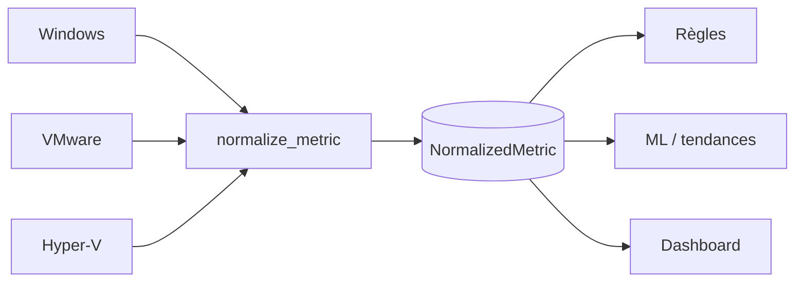

# Métriques normalisées

## Contrat commun

Toute source produit un `NormalizedMetric` contenant :

| Champ | Rôle |
|---|---|
| `timestamp` | instant ISO-8601 de la mesure |
| `customer`, `environment`, `machine` | scope reconstruit côté serveur |
| `source_type` | `WINDOWS`, `VMWARE`, `HYPERV` ou source compatible |
| `metric_name` | nom canonique ou nom spécifique conservé |
| `metric_value` | nombre fini, éventuellement `null` pour un état indisponible |
| `unit`, `status` | unité commune et état textuel optionnel |
| `metadata` | dimensions et informations spécifiques non perdues |
| `idempotency_key` | déduplication optionnelle par tenant |
| `received_at` | arrivée côté serveur |



## Noms et unités communs

Les aliases `cpu`, `cpu.percent` et `cpu_usage` deviennent
`system.cpu.utilization`; les CPU Windows, VMware et Hyper-V alimentent donc le
même moteur. Les principaux noms sont `system.memory.utilization`,
`system.disk.utilization`, `system.disk.free`, `system.disk.io.read`,
`system.disk.io.write`, `system.network.in`, `system.network.out`,
`system.network.latency`, `system.uptime`, `system.process.count` et
`system.gpu.utilization`.

Les taux KiB/MiB/GiB par seconde sont convertis en `bytes/s`; l'unité initiale est
gardée dans `metadata.original_unit`. Les noms spécifiques sont conservés :
`windows.service.state`, `vmware.datastore.utilization` et
`virtual.machine.state`. Un collecteur peut aussi émettre un nom source plus précis;
il reste analysable et ses dimensions sont conservées dans `metadata`.

## Validation et dimensions

Le normalizer rejette nom absent ou trop long, timestamp invalide ou de plus de cinq
minutes dans le futur, NaN/infini, metadata non objet, clé trop longue, lot vide ou
lot supérieur à 5 000 mesures. Il marque `raw_metric_name` et
`normalizer_version=2.0`. Les règles distinguent les dimensions `service_name`,
`mountpoint`, `device`, `gpu_index` et `datastore` afin qu'un volume sain ne masque
pas un autre volume en alerte.

## Exemple d'ingestion agent

```http
POST /api/agent/metrics/
X-Agent-Token: <token-opaque>
Content-Type: application/json

{"metrics":[{"timestamp":"2026-08-25T06:00:00Z","metric_name":"cpu.percent","metric_value":91.4,"unit":"%","idempotency_key":"host-a:cpu:1756101600"}]}
```

Le customer, l'environnement, la machine et le `source_type` ne sont pas acceptés
comme autorité depuis ce payload : ils proviennent de l'agent authentifié.

## Tests et dépannage

Les tests couvrent les aliases multi-sources, conversions, validations, lots,
idempotence et isolation tenant. Une métrique absente du dashboard doit être
recherchée via `/api/metrics/?machine=<uuid>&metric_name=<nom>` puis dans les logs
d'ingestion. Une valeur `null` n'est pas inventée ni évaluée par les seuils.
