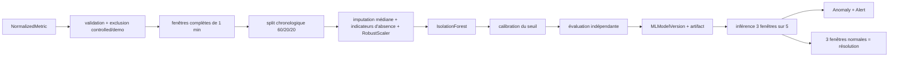

# Pipeline Machine Learning

## Pipeline reproductible



Les features obligatoires proviennent exclusivement de `NormalizedMetric` : CPU,
RAM, utilisation disque maximale par volume, réseau entrant/sortant et latence.
Les features GPU sont optionnelles : utilisation, mémoire utilisée, pourcentage de
mémoire et température. Une feature GPU n'entre dans une nouvelle version que si
au moins une machine dispose d'au moins 200 fenêtres et 50 % de couverture.

L'absence d'un GPU n'est jamais convertie silencieusement en zéro. L'imputation
médiane est accompagnée d'un indicateur d'absence pour chaque feature optionnelle ;
un GPU présent et inactif à `0 %` reste donc distinct d'une télémétrie absente.
La version de schéma (`2.0`), l'ordre des features et le contrat
`feature_names_in_` de l'artifact sont vérifiés avant l'inférence. Les anciens
modèles à six features restent compatibles avec le schéma `1.0`.

Paramètres actuels :

```text
n_estimators=200
contamination=0.02
random_state=42
n_jobs=-1
minimum training windows=200
window=1 minute complète
target calibration quantile=0.99
```

L'utilisation disque, l'utilisation GPU, le pourcentage VRAM et la température
GPU sont agrégés par maximum dans la fenêtre. La mémoire GPU utilisée, qui est une
jauge, est aussi agrégée par maximum et jamais par somme. Le bucket courant est
exclu afin de ne pas scorer une fenêtre incomplète.

## Entraînement, calibration et évaluation

Les lignes sont triées chronologiquement. Les premiers 60 % ajustent le
prétraitement et Isolation Forest, les 20 % suivants calibrent le seuil, et les
20 % finaux restent une évaluation indépendante. Le seuil est le maximum des
quantiles 0,99 des scores `-decision_function` training et calibration.

Sans vérité terrain, `false_positive_rate`, précision et rappel restent `null`.
Les champs `training_anomaly_rate`, `calibration_anomaly_rate`,
`validation_anomaly_rate` et `validation_stable_flag_rate` sont des taux de
signalement empiriques, pas un taux de faux positifs prouvé.

`MLModelVersion` stocke version, date, features, schéma, couverture, paramètres,
description du dataset, métriques d'évaluation, seuil et chemin relatif de
l'artifact. L'écriture est atomique et PostgreSQL n'autorise qu'un modèle actif
par tenant. `display_number` est un numéro lisible croissant ; `version` reste
l'identifiant technique immuable.

## Stabilité temporelle et récupération

Une fenêtre isolée ne produit plus une alerte HIGH. Le moteur regarde les cinq
dernières fenêtres complètes d'une machine et exige :

- au moins trois fenêtres anormales sur cinq ;
- que la fenêtre la plus récente soit anormale ;
- trois fenêtres normales consécutives pour résoudre les alertes ML ouvertes.

Avec la collecte Windows toutes les 30 secondes et les buckets de 1 minute, ce
choix requiert plusieurs minutes de persistance tout en tolérant deux fenêtres
bruitées. Celery Beat planifie l'analyse chaque minute et l'idempotence utilise la
minute complète, non une tranche de dix minutes. La clé d'alerte `ml:active` reste
stable entre deux versions ; le cooldown de 300 secondes évite les événements
temps réel et notifications causés uniquement par un score fluctuant.

## Données réelles, contrôlées et synthétiques

Par défaut, les métriques dont `metadata` contient `test_marker`, `synthetic` ou
`demo` sont exclues du training et de l'inférence. Le script
`scripts/performance/label_controlled_metrics.py` est en dry-run par défaut et ne
peut étiqueter qu'un rapport portant `CONTROLLED_TEST`.

La commande `prepare_pfe_demo` utilise explicitement `include_controlled=True`,
crée au moins 200 fenêtres, marque partout `synthetic=true` et
`data_classification=SYNTHETIC_DEMO`, puis fournit cinq fenêtres anormales
complètes pour démontrer la politique 3/5. Ces résultats ne sont jamais une preuve
de performance réelle.

## Validation réelle du 30 août 2026

Le modèle réel n°8 (`iforest-20260830T101505-3d2d89e3`) a été entraîné après
exclusion de 486 métriques contrôlées :

| Élément | Résultat observé |
|---|---:|
| fenêtres | 529 |
| training / calibration / validation | 317 / 106 / 106 |
| features actives | 6 système + `system.gpu.utilization` |
| seuil | 0,0417423575 |
| taux fenêtres validation | 10,38 % |
| taux stable validation 3/5 | 4,90 % |
| vérité terrain / FPR | indisponible / non calculé |

Les trois alertes HIGH signalées par le rapport initial et une alerte corrélée
ouverte pendant l'observation corrective ont été résolues par
`ml_recovery_hysteresis` à 10:20:08Z après trois fenêtres normales. Après les
charges contrôlées CPU/GPU, l'inférence retourne zéro nouvelle anomalie et aucune
alerte ML ouverte.

La charge GPU réelle a atteint 65 % et 4 204 MiB de VRAM. La télémétrie et les
features sont valides, mais les fenêtres observées sont restées sous le seuil du
modèle : la détection d'une anomalie GPU n'est donc pas déclarée PASS. Les trois
nouvelles séries mémoire/température n'ont pas encore 200 fenêtres historiques et
seront sélectionnées seulement après acquisition suffisante.

## Commandes et API

```powershell
./.venv/Scripts/python.exe backend/manage.py evaluate_ml --customer-id <uuid> --days 30
```

`POST /api/ml/models/train/` et `POST /api/ml/models/evaluate/` planifient les
tâches autorisées. `GET /api/ml/models/` et `/api/anomalies/` exposent versions et
résultats. Les artefacts résident dans `ML_MODEL_DIR`, partagé par API et workers
et sauvegardé avec PostgreSQL. Voir aussi [ML_EVALUATION.md](ML_EVALUATION.md) et
[PREDICTIVE_ANALYSIS.md](PREDICTIVE_ANALYSIS.md).

## Limites

Isolation Forest signale une rareté statistique, pas une cause. La validation ne
dispose pas de labels d'incidents réels et ne peut donc pas fournir un vrai FPR,
une précision ou un rappel. La politique 3/5 réduit les incidents instantanés mais
augmente volontairement la latence de détection. Une flotte mixte doit accumuler
assez d'historique GPU par machine avant qu'une feature optionnelle soit activée.
