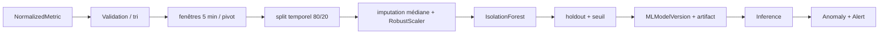

# Pipeline Machine Learning

## Pipeline reproductible



Features : CPU, RAM, disque, réseau entrant/sortant et latence, issues des métriques
normalisées. Paramètres initiaux : `n_estimators=200`, `contamination=0.02`,
`random_state=42`, `n_jobs=-1`. L'imputation et `RobustScaler` font partie du même
pipeline sérialisé que le modèle. Le seuil est le quantile de contamination du
score `-decision_function` calculé sur le training.

## Training, registry et inférence

Les fenêtres sont triées; 80 % ajustent preprocessing, Isolation Forest et seuil,
20 % forment le holdout chronologique. Moins de 20 fenêtres provoquent un refus.
`MLModelVersion` stocke version, date, features, preprocessing, paramètres,
description du dataset, métriques d'évaluation, seuil et chemin relatif de
l'artifact. L'écriture est atomique et une contrainte PostgreSQL autorise un seul
modèle actif par tenant.

Deux identifiants ont des responsabilités différentes :

- `version` reste l'identifiant technique immuable utilisé pour les artefacts,
  l'inférence, les anomalies, l'audit et la traçabilité ;
- `display_number` est un numéro entier persistant, croissant et unique par
  client. Il est alloué sous verrou client pendant l'entraînement.

La migration `0003_mlmodelversion_display_number` numérote l'historique existant
par `created_at`, puis UUID, sans modifier `version`. L'interface construit ainsi
le libellé français `Isolation Forest — Modèle N` et réserve l'identifiant
technique à la section « Détails scientifiques ».

Training et inférence sont des tâches séparées et idempotentes. L'inférence crée une
`Anomaly` unique par tenant/machine/modèle/fenêtre et peut corréler une alerte avec
un score. Les artefacts résident dans `ML_MODEL_DIR`, qui doit être partagé par API
et workers et sauvegardé avec la base.

## Données synthétiques

La production ne génère pas de données pour entraîner silencieusement un modèle.
La commande PFE `prepare_pfe_demo` peut créer un dataset **synthétique explicitement
marqué** (`dataset.synthetic=true`) et l'interface affiche ce statut. Il ne doit pas
être présenté comme preuve de performance sur données réelles.

## Commandes et API

```powershell
./.venv/Scripts/python.exe backend/manage.py evaluate_ml --customer-id <uuid> --days 30
```

`POST /api/ml/models/train/` et `POST /api/ml/models/evaluate/` planifient les tâches
autorisées; `GET /api/ml/models/` et `/api/anomalies/` exposent versions et résultats.
Le contrat exact est dans `/api/docs/`.

`GET /api/ml/models/` renvoie l'historique par `display_number` décroissant. Les
champs `version`, `display_number`, `active` et `status` sont en lecture seule ;
aucun endpoint d'activation manuelle n'est annoncé. Le nouveau modèle devient
actif uniquement après un entraînement réussi, et l'ancien est désactivé dans la
même transaction.

## Limites et dépannage

Sans labels d'incidents réels, précision, rappel et F1 restent `null`. Isolation
Forest signale une rareté statistique, pas une cause. En cas d'absence de modèle,
vérifier le nombre de fenêtres, Beat/worker, `TaskRun`, le volume `ML_MODEL_DIR` et
les permissions de fichier. Voir [évaluation](ML_EVALUATION.md) et
[analyse prédictive](PREDICTIVE_ANALYSIS.md).
