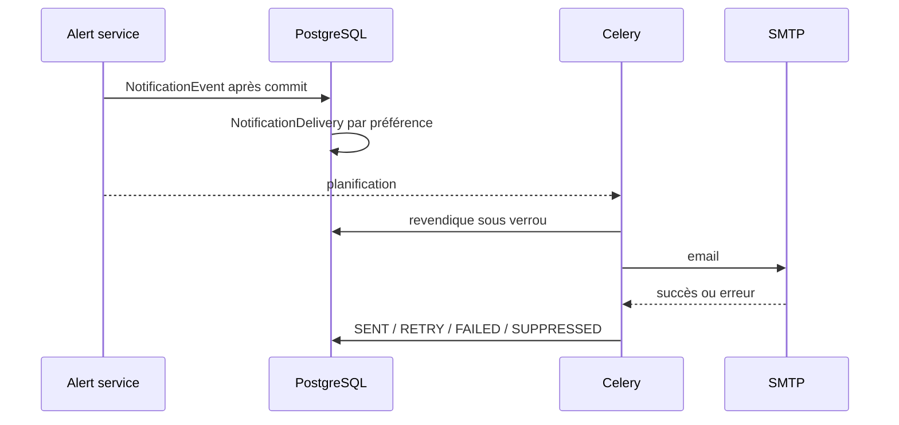

# Notifications

## Canaux et politique

Email est le seul adaptateur d'envoi implémenté. Les valeurs Teams, Slack et Telegram
existent dans le modèle pour extension, mais une livraison sur ces canaux échoue de
façon contrôlée tant qu'aucun adaptateur n'est ajouté.

| Sévérité | Comportement actuel |
|---|---|
| `CRITICAL` | événement immédiat, sous réserve d'une préférence Email active |
| `HIGH` | selon préférence et cooldown |
| `WARNING` / `INFO` | dashboard/temps réel uniquement |

## Flux non bloquant



La requête principale n'effectue aucun SMTP. Un worker revendique sous verrou, vérifie
sévérité et cooldown, reprend un `SENDING` abandonné, puis applique un retry
exponentiel. Après huit essais, la livraison devient `FAILED`; `SENT` et
`SUPPRESSED` sont terminaux. Une escalade HIGH vers CRITICAL contourne le cooldown.

## API et configuration

- `/api/notifications/preferences/` : CRUD tenant des destinations et seuils.
- `/api/notifications/deliveries/` : historique paginé et statut d'envoi.

```dotenv
EMAIL_BACKEND=django.core.mail.backends.smtp.EmailBackend
DEFAULT_FROM_EMAIL=InfraSentinel <noreply@example.org>
EMAIL_HOST=smtp.example.org
EMAIL_PORT=587
EMAIL_HOST_USER=<compte>
EMAIL_HOST_PASSWORD=<secret>
EMAIL_USE_TLS=true
EMAIL_TIMEOUT=30
```

Le backend console est la valeur locale par défaut et n'envoie pas d'email externe.
Ne jamais exposer le mot de passe SMTP dans l'API, les logs ou une capture PFE.

## Tests et diagnostic

Les tests couvrent préférences, tenant, déduplication, cooldown, escalade, reprise,
retry/échec et adaptateur Email simulé. Aucun SMTP externe n'a été validé. Une
livraison bloquée se diagnostique dans `/api/notifications/deliveries/`, les logs du
worker et Beat; vérifier aussi `next_attempt_at`, seuil, destination et backend SMTP.
