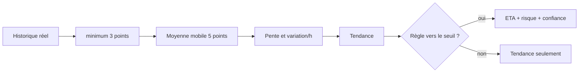

# Analyse prédictive
## Périmètre réel

`GET /api/machines/<id>/trends/?hours=24` analyse l'historique normalisé de la
machine demandée. Il ne s'agit pas d'un second modèle entraîné : le service réalise
une projection linéaire explicable sur des mesures existantes.

Pour chaque métrique comportant au moins trois points, il calcule une moyenne
glissante sur les cinq derniers points, une pente, un taux de variation horaire et
une tendance `INCREASING`, `DECREASING` ou `STABLE`. Si une règle applicable possède
un seuil et si la pente se dirige vers lui, une date estimée de franchissement, un
risque et une confiance basée sur le volume et la durée observée peuvent être
retournés. Une projection supérieure à dix ans est ignorée.



## Exemple

```http
GET /api/machines/16dbf82b-6ebf-4db5-8673-52fd0eb6227f/trends/?hours=24
Authorization: Bearer <access-token>
```

Le serveur vérifie que la machine appartient au tenant de l'utilisateur. Chaque
résultat porte `is_estimate=true` et un avertissement : la projection est une aide
à l'analyse, jamais une certitude ni une action automatique.

## Interprétation et limites

- Une pente linéaire ne capture ni saisonnalité, ni changement de workload.
- Une forte confiance interne décrit la quantité/étendue des points, pas une
  probabilité calibrée de panne.
- Les périodes sans métriques peuvent biaiser la pente; vérifier la complétude.
- Le dashboard n'affiche pas de prédiction lorsque l'historique est insuffisant.
- Les données synthétiques de démonstration sont signalées comme telles et ne
  valident pas la qualité prédictive sur données réelles.

Les tests couvrent points insuffisants, tendances, projection vers une règle,
isolation tenant et contrat API. Pour diagnostiquer une réponse vide, vérifier
`hours`, le nombre de points par nom canonique et les règles actives de la machine.
