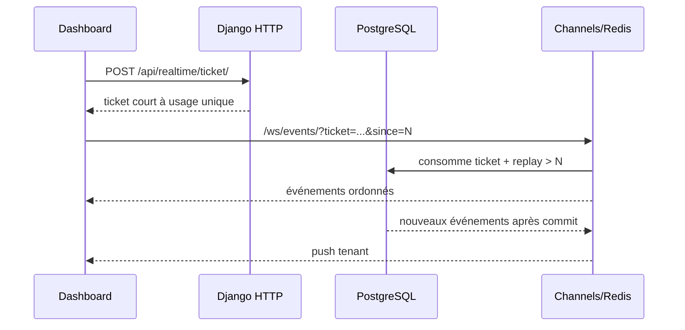

# Temps réel et WebSocket

## Flux

Événements : `machine.online`, `machine.offline`, `metric.update`, `alert.created`,
`alert.updated`, `anomaly.detected`. `RealtimeEvent` est conservé dans PostgreSQL
avant diffusion, ce qui permet la reprise quand Redis ou le socket est indisponible.

## Sécurité et isolation

Le navigateur obtient via HTTP authentifié un ticket signé valable 60 secondes. Le
nonce aléatoire n'est stocké que sous forme de hash et devient utilisé au premier
handshake. Le consumer valide `Origin`, utilisateur actif, tenant actif, durée de
session, puis rejoint uniquement `tenant_<uuid>`. Le token JWT n'est jamais placé
dans l'URL WebSocket.

Le paramètre ticket reste néanmoins visible dans la query string : le reverse proxy
doit le supprimer de ses access logs. La durée maximale vient de
`WEBSOCKET_SESSION_MAX_SECONDS` (60 à 86 400 s, 900 s par défaut).

## Reprise et fallback

`since` est le dernier numéro de séquence reçu. Le consumer rejoue jusqu'à 500
événements ordonnés; `/api/realtime/replay/?since=N` offre le même mécanisme HTTP.
Le frontend conserve un curseur par tenant en session, reconnecte avec backoff et
garde un polling toutes les 30 secondes lorsque WebSocket échoue. Plusieurs onglets
nécessitent chacun leur ticket.

## Tests et dépannage

Les tests ASGI couvrent connexion, ticket invalide/réutilisé, origine, replay,
reconnexion, clients multiples, déconnexion et isolation. Pour un dashboard figé :

1. vérifier `VITE_WS_URL`, `CORS_ALLOWED_ORIGINS` et le proxy Upgrade;
2. vérifier Redis/channel layer et la présence de `RealtimeEvent`;
3. demander un nouveau ticket, jamais réutiliser l'ancien;
4. vérifier que le polling fallback continue;
5. si plus de 500 événements manquent, paginer l'endpoint replay avant de reprendre.
