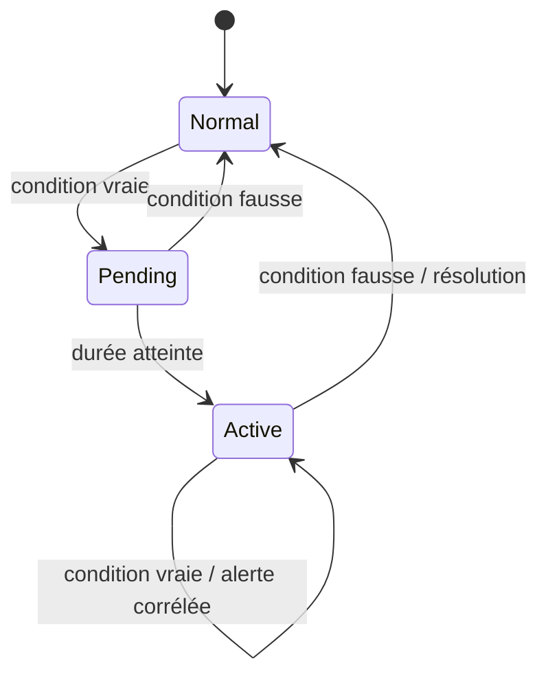

# Moteur de règles

## Modèle

`MonitoringRule` porte `name`, `metric`, `operator`, `threshold`,
`duration_seconds`, `severity`, `enabled`, les scopes optionnels `environment` et
`machine`, et `cooldown_seconds`. Les opérateurs acceptés sont `>`, `<`, `>=`,
`<=`, `==` et `!=`. Les sévérités sont `INFO`, `WARNING`, `HIGH`, `CRITICAL`.

`RuleState` mémorise par règle, machine et dimension le premier instant vrai, la
dernière mesure évaluée, sa valeur et l'état actif. La contrainte unique rend cet
état déterministe pour un service, volume, disque, GPU ou datastore.

## Évaluation temporelle



Les mesures sont lues dans l'ordre temporel; une mesure plus ancienne que le dernier
état est ignorée. Une condition vraie doit rester vraie pendant la durée configurée.
Une valeur normale réinitialise l'état et résout l'alerte correspondante. La règle
spéciale `machine.online` évalue `last_seen` et bascule la machine hors ligne après
sa durée.

## API

`/api/rules/` expose le CRUD paginé. Les ADMIN/SUPERVISOR gèrent les règles de leur
tenant; le backend valide que machine et environnement appartiennent au même
customer. L'action d'activation/désactivation documentée par OpenAPI est la source
de vérité; consulter `/api/docs/` pour le corps exact de la version déployée.

```json
{
  "name": "CPU durable > 90 %",
  "metric": "system.cpu.utilization",
  "operator": ">",
  "threshold": 90,
  "duration_seconds": 300,
  "severity": "HIGH",
  "enabled": true,
  "environment": null,
  "machine": null,
  "cooldown_seconds": 600
}
```

## Exécution et limites

Celery Beat appelle `monitoring.evaluate_rules` chaque minute. L'ancien comportement
instantané reste représentable avec une durée nulle; les seuils ne sont plus codés
dans les collecteurs. La précision effective d'une durée dépend toutefois de la
fréquence de collecte et de Beat. Une absence de mesures n'est pas identique à une
valeur basse : utiliser `machine.online` pour la disponibilité.

Les tests couvrent opérateurs, durée, résolution, dimensions, offline, concurrence
et isolation multi-tenant. En cas de déclenchement tardif, vérifier la fréquence des
métriques, les timestamps, Beat, le worker et le `RuleState` correspondant.
