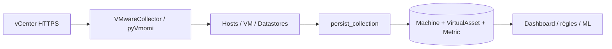

# Intégration VMware

Le module `vmware_connector` utilise réellement pyVmomi : `SmartConnect`, vues
`vim.HostSystem`/`vim.VirtualMachine` et `PerformanceManager`. La configuration
contient endpoint, utilisateur, TLS, timeout et `secret_ref`; le mot de passe est
lu depuis la variable nommée par `secret_ref`.

Hôtes : CPU, mémoire, stockage utilisé/libre, réseau reçu/transmis, uptime,
health, modèle, vendor et nombre de VM. VM : CPU, RAM, disque, réseau, uptime,
power state, hôte parent, guest et datastores. Les datastores sont aussi découverts
comme assets avec capacité libre, taux d'utilisation, accessibilité, type et URL.
Les compteurs réseau vSphere en KiB/s sont convertis en `bytes/s`. Les compteurs
indisponibles restent `null` : aucune valeur n'est inventée.

La découverte crée/met à jour `VirtualAsset` et `Machine`, puis normalise les
mesures avant PostgreSQL, règles, ML et dashboard. Les erreurs connexion/auth/TLS,
timeouts et ressources indisponibles sont enregistrées dans `CollectionRun` et le
connecteur. Celery applique retry/backoff.

Les tests mock prouvent orchestration, idempotence, calcul datastore et erreurs,
mais pas une session vCenter réelle.

`NOT TESTED — REAL VMWARE ENVIRONMENT REQUIRED`

## Flux, configuration et API



Le connecteur est créé sous `/api/connectors/` avec `kind=VMWARE`, un environnement
du même tenant, un endpoint HTTPS, un utilisateur, `verify_tls`, timeout et le nom
d'une variable secrète :

```json
{
  "kind": "VMWARE",
  "name": "vcenter-principal",
  "endpoint": "https://vcenter.example.net",
  "username": "svc_infrasentinel@example.net",
  "secret_ref": "VCENTER_MAIN_PASSWORD",
  "verify_tls": true,
  "timeout_seconds": 30,
  "enabled": true,
  "environment": "<uuid>"
}
```

Le mot de passe est lu par le worker dans `VCENTER_MAIN_PASSWORD`; l'API ne retourne
pas sa valeur. `CONNECTOR_ALLOWED_HOSTS` limite les cibles et la désactivation TLS
exige `ALLOW_INSECURE_CONNECTOR_TLS=true`. `/api/vmware/overview/`, `/api/assets/`
et `/api/collection-runs/` exposent synthèse, inventaire et runs.

## Dépannage

- authentification : vérifier compte de service et permissions de lecture vSphere;
- certificat : importer la CA correcte plutôt que désactiver la vérification;
- compteur `null` : vérifier sa disponibilité vSphere; aucun zéro n'est inventé;
- aucun asset : vérifier allowlist, connecteur activé, worker et dernier run;
- timeout : mesurer latence/charge vCenter avant d'augmenter la limite.
